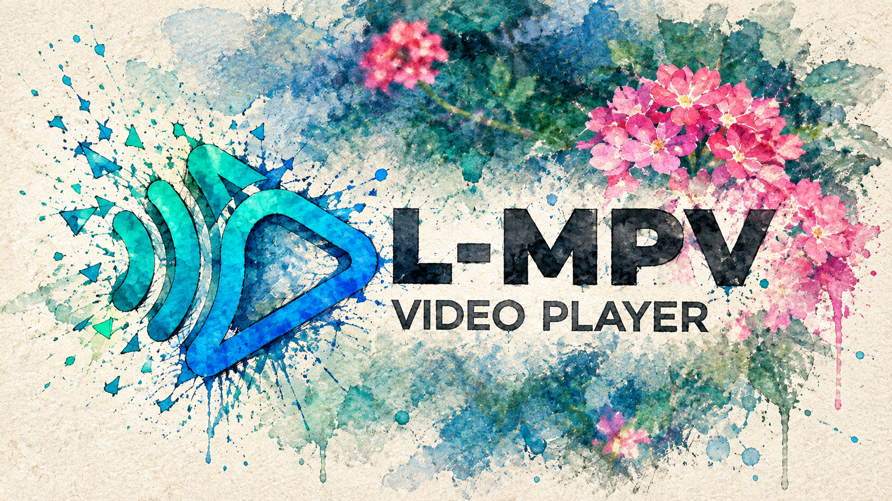
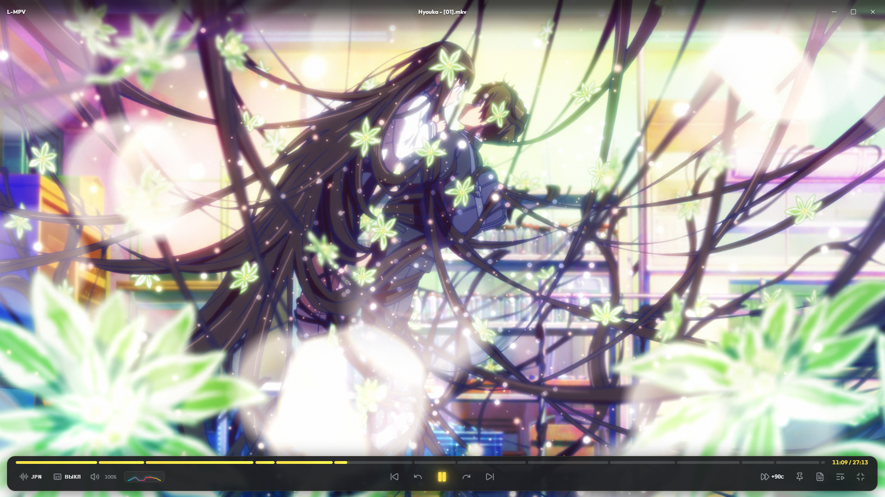
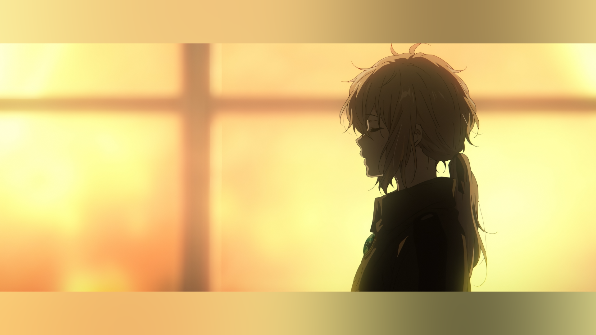
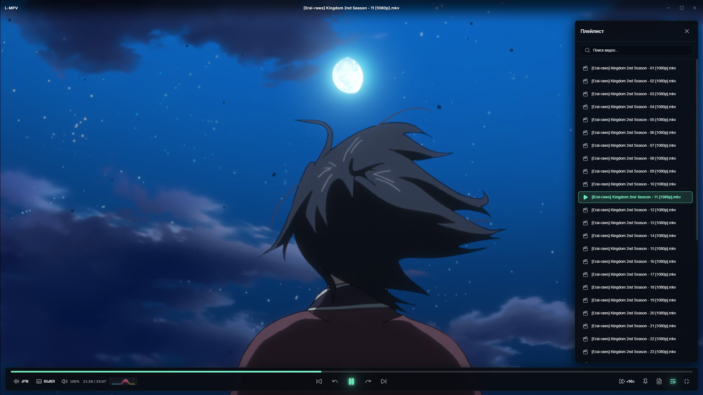
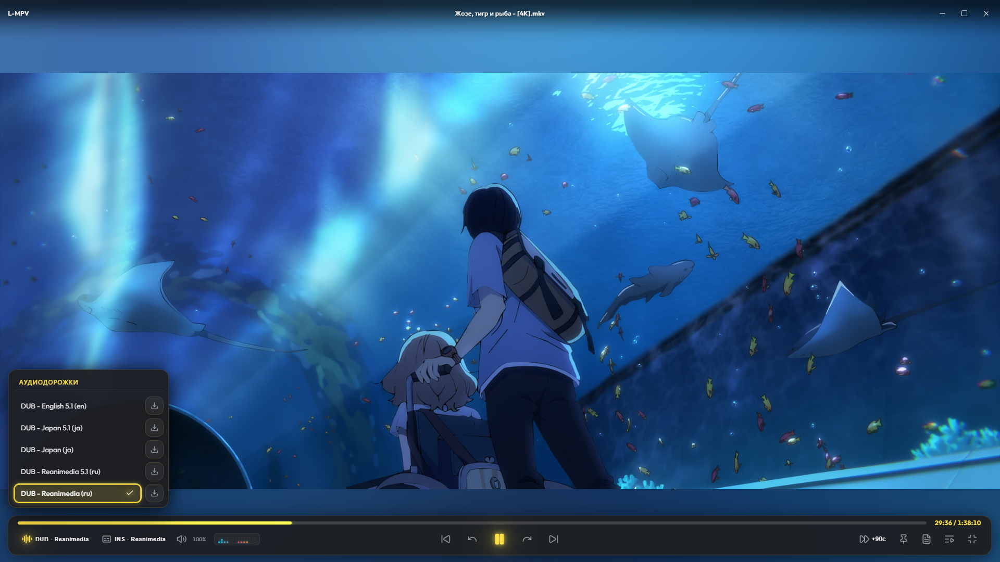
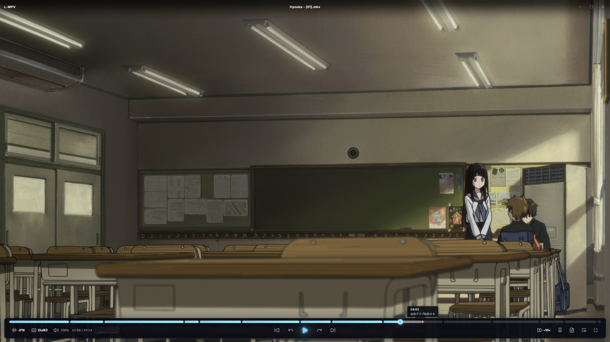
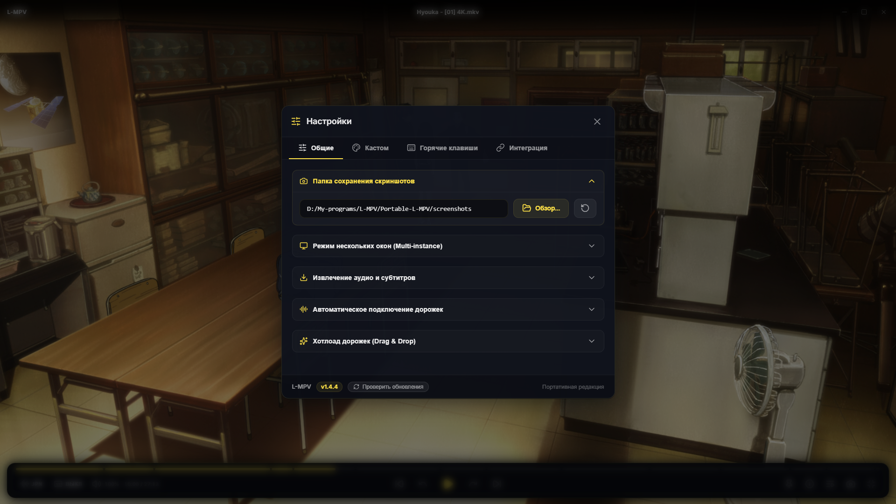
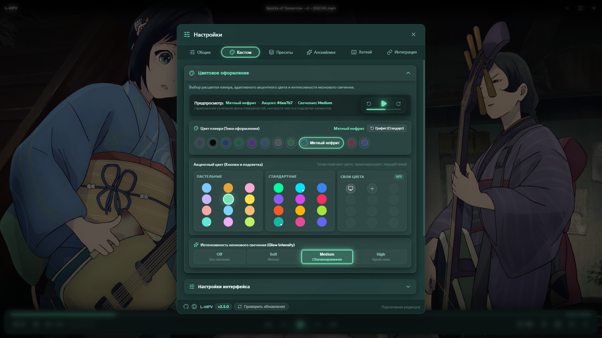

<p align="center">
  
</p>

<h1 align="center">🎬 L-MPV — Modern & Portable Media Player</h1>

<p align="center">
  <b>Высокопроизводительный, эстетичный и 100% портативный медиаплеер нового поколения.</b><br>
  Построена на базе <b>Tauri v2</b>, <b>React 19</b> и нативного движка <b>libmpv</b> (C-FFI).
</p>

<p align="center">
  
  
  
  
  
  
  
  
  
</p>

---

## 🌟 О проекте

**L-MPV** — это современный настольный медиаплеер для Windows, объединяющий эталонное качество воспроизведения нативного видеодвижка **MPV** (`vo=gpu-next`, Direct3D 11, HDR, WASAPI, студийный 32-tap sinc-ресемплинг) с утонченным, отзывчивым интерфейсом в стиле **Glassmorphism**, созданным на **React 19** и **TypeScript**.

Плеер спроектирован по строгой концепции **True Portable Architecture (Zero-Install)**: он полностью автономен, не привязан к системному реестру Windows и не создает мусор в системных каталогах пользователя. Все конфигурации, кэш миниатюр, скриншоты и нативные бинарные библиотеки (`libmpv-2.dll`, `ffmpeg.exe`) расположены непосредственно в каталоге приложения.

<p align="center">
  
</p>

---

## 📸 Скриншоты Интерфейса

<table width="100%">
  <tr>
    <td width="50%" align="center">
      <b>🌌 Аппаратная Подсветка Полос</b><br>
      <sub>Шейдерное размытие краев видео (Ambient)</sub><br><br>
      <a href="./assets/ambient-light-demo.png"></a>
    </td>
    <td width="50%" align="center">
      <b>📑 Выдвижная Панель Плейлиста</b><br>
      <sub>Автоматическое сканирование каталога, фильтрация и живой поиск</sub><br><br>
      <a href="./assets/playlist-drawer.png"></a>
    </td>
  </tr>
  <tr>
    <td width="50%" align="center">
      <b>🎧 Управление Дорожками и Экспорт в 1 Клик</b><br>
      <sub>Быстрая смена аудио/субтитров и скачивание</sub><br><br>
      <a href="./assets/audio-window.png"></a>
    </td>
    <td width="50%" align="center">
      <b>🔖 Интерактивная Навигация по Главам</b><br>
      <sub>Список глав с таймкодами и подсветкой активной части видео</sub><br><br>
      <a href="./assets/interface-chapter-player.png"></a>
    </td>
  </tr>
  <tr>
    <td width="50%" align="center">
      <b>⚙️ Центр Настроек</b><br>
      <sub>Управление скриншотами, режимом окон и системными ассоциациями</sub><br><br>
      <a href="./assets/settings-general-player.png"></a>
    </td>
    <td width="50%" align="center">
      <b>🎨 Кастомизация</b><br>
      <sub>Выбор акцентных цветов интерфейса и индивидуальная настройка хоткеев</sub><br><br>
      <a href="./assets/settings-customization-player.png"></a>
    </td>
  </tr>
</table>

---

## ✨ Ключевые Возможности

### ⚡ Рендеринг Нового Поколения (`vo=gpu-next`)
- **GPU-HQ пайплайн:** профиль `profile=gpu-hq`, нативный Direct3D 11 (`gpu-api=d3d11`) и аппаратное декодирование `hwdec=auto-safe`.
- **Прецизионное масштабирование:** алгоритмы интерполяции `scale=spline36` и `cscale=spline36` для идеальной четкости деталей и цветовых переходов.
- **Интеллектуальный HDR:** автоматическая передача метаданных в дисплей (`target-colorspace-hint=yes`), динамический расчет пиков яркости (`hdr-compute-peak=yes`) и адаптивный tone mapping.
- **Zero-Flicker жизненный цикл:** окно создается в скрытом режиме, рассчитывает истинный Display Aspect Ratio видео, центрируется и отображается (`window.show()`) строго тогда, когда интерфейс и первый видеокадр готовы к показу, исключая любые рывки геометрии и мерцания.
- **Прямой вывод в окно:** видеопоток отрисовывается в нативный Win32 HWND через C-FFI с нулевой задержкой под полностью прозрачным DOM-слоем WebView2 (`transparent: true`).

### 🌌 Аппаратная Подсветка Полос (Ambient Light / GPU Blur)
- **Устранение черных полос:** при несовпадении пропорций видео и монитора (21:9 на 16:9, 4:3, нестандартные форматы) края видеокадра аппаратно проецируются и размываются в областях letterbox и pillarbox на базе шейдеров `libplacebo` без нагрузки на процессор.
- **3 режима работы:**
  - `Off` — классические черные полосы;
  - `Blur` — аппаратное шейдерное размытие кадра в реальном времени с плавной регулировкой радиуса (от 10 до 150 px);
  - `Color` — мягкая заливка акцентным цветом плеера (включая системный цвет Windows Accent) или кастомным оттенком HEX.
- **Производительность 60 FPS:** мгновенный GPU-предпросмотр (`apply_ambient_preview`) без блокирующего дискового ввода-вывода с дебаунсом сохранения на диск (400 мс).
- **Быстрое управление:** переключение по горячей клавише `B`, в контекстном меню (ПКМ) и в Настройках.

### 🎧 Студийный Аудиофильский Звук (Audiophile Profile)
- **Низколатентный вывод:** нативный драйвер Windows WASAPI (`ao=wasapi`) с оптимизированным буфером 0.2 с.
- **Студийный 32-точечный sinc-ресемплинг:** фильтр `audio-resample-filter-size=32`, 16 384 фазы сдвига (`audio-resample-phase-shift=14`) и линейная интерполяция между отсчетами (`audio-resample-linear=yes`).
- **Нормализованный даунмикс:** автоматическое безопасное сведение многоканального аудио 5.1/7.1 в стерео (`audio-normalize-downmix=yes`) с аппаратной защитой от перегрузок и клиппинга.
- **Коррекция тона:** сохранение естественной высоты тона звука при изменении скорости (`audio-pitch-correction=yes`, scaletempo2).

### 📥 Мгновенное Извлечение и Экспорт Дорожек (Track Extraction)
- **Экспорт звука и субтитров в 1 клик:** встроенные кнопки скачивания в меню аудиодорожек и субтитров на нижней панели и в контекстном меню (ПКМ).
- **Direct Stream Copy (`-c copy`):** мгновенное извлечение без перекодирования и без малейшей потери исходного качества за считанные секунды.
- **Умный многопоточный фоллбек (`-threads 0`):** автоматическая конвертация несовместимых кодеков (например, субтитры `mov_text` автоматически конвертируются в формат `.srt`).
- **Прямое копирование внешних файлов:** мгновенное копирование уже подключенных внешних субтитров без обращения к FFmpeg.
- **Гибкие пути сохранения:** возможность автоматического сохранения рядом с видеофайлом либо через системный проводник.
- **Анимированная индикация:** спиннер в меню и статусная строка прогресса на панели управления.

### 🎨 Премиальный Glassmorphic UX/UI
- **Плавающая панель управления:** минималистичная нижняя «таблетка» с акцентной подсветкой, быстрым доступом к аудио, субтитрам, главам, скриншотам, скорости и плейлисту.
- **Цветовая кастомизация:** палитра чистых монохромных и пастельных акцентов (Amber `#e8a236`, Pink `#FFA9DE`, системный цвет Windows Accent и др.).
- **Умный IDLE-режим:** плавное автоскрытие курсора и панелей при непрерывном просмотре; интерфейс никогда не гаснет, пока курсор находится над элементами управления или открыты меню/модальные окна.
- **Кастомное ПКМ-меню:** доступ ко всем настройкам видео, аудио, масштабирования, поворота и подсветки полос по правому клику.

### 🔍 Аппаратный Zoom & Pan и Колесо Мыши
- **Плавное масштабирование кадра:** центрированный зум относительно курсора по комбинации `Ctrl` + Колесо мыши с частотой до 60 FPS.
- **Магнитная привязка:** автоматическое прилипание к исходному масштабу (100%) при приближении к нулевому зуму.
- **Мгновенный сброс:** возврат к 100% масштабу и центрированию по клавише `Ctrl + 0`.
- **Регулировка громкости:** прокрутка колеса мыши над видео без клавиши `Ctrl` плавно меняет громкость с шагом 5% и сохранением уровня.

### 🖥️ Smart Fullscreen, PiP и Оконный Режим
- **Настоящий полноэкранный режим:** гарантированное скрытие панели задач Windows через Win32 флаг `HWND_TOPMOST` и DWM Cloaking без смещения кадра в угол (0, 0).
- **Динамический Z-порядок (`handle_window_focus`):** при переключении на другое приложение (`Alt+Tab`) плеер автоматически снимает статус Topmost, позволяя окнам свободно открываться поверх плеера, и мгновенно восстанавливает его при возврате фокуса.
- **Режим PiP (Поверх всех окон):** фиксация компактного окна плеера поверх остальных окон клавишей `T` или кнопкой-булавкой.
- **Пропорции и поворот:** изменение соотношения сторон (Оригинальное, 16:9, 21:9 CinemaScope, 4:3) и поворот видеокадра на 0°, 90°, 180°, 270°.

### 📋 Буфер Обмена и Чистые Скриншоты
- **Кадр в буфер обмена по `Ctrl + C`:** мгновенный захват текущего кадра без OSD напрямую в буфер обмена Windows через нативную команду `copy_frame_to_clipboard` (без сохранения временных файлов).
- **Чистый скриншот:** сохранение кадра в высоком качестве (PNG) по клавише `S` или иконке камеры с уведомлением в OSD.
- **Пользовательская папка:** выбор папки сохранения в настройках или сброс на локальную папку `screenshots/`.

### 📑 Умный Плейлист и Навигация
- **Автоматический плейлист с Natural Sort:** при открытии файла плеер находит все видео в директории и выстраивает плейлист в естественном порядке нумерации файлов.
- **Выдвижная панель Playlist Drawer (`L` / `P`):** мгновенный поиск, фильтрация, подсветка активного трека и переключение в один клик.
- **Drag & Drop:** поддержка перетаскивания файлов и сетевых URL напрямую в окно плеера.
- **Режимы повтора и Shuffle:** циклическое воспроизведение текущего файла, всего плейлиста или случайный порядок.
- **Главы (Chapters):** модальное окно навигации по встроенным главам файла с интерактивными таймкодами.
- **Возобновление просмотра (Resume Playback):** сохранение последней позиции для каждого просмотренного файла.
- **Интеграция с Windows Taskbar:** отображение индикатора прогресса воспроизведения прямо на иконке плеера в панели задач Windows.

### ⚙️ Гибридная Система Кастомизации Управления
- **Полная перепривязка хоткеев:** поддержка комбинаций клавиш с модификаторами (`Ctrl`, `Shift`, `Alt`) и кликов мыши (`MouseLeft`, `MouseRight`, `MouseMiddle`, `MouseLeftDoubleClick`).
- **Раздельные действия:** индивидуальные бинды для смены аудио/субтитров кликом и открытия их меню.
- **Точечный сброс:** персональная кнопка сброса «По умолчанию» рядом с каждым действием.
- **Ассоциации файлов:** регистрация медиафайлов в реестре Windows и быстрый переход в параметры Windows «Приложения по умолчанию».

---

## 🏗️ Стек Технологий

<table>
  <tr>
    <th>Уровень</th>
    <th>Технологический стек</th>
    <th>Назначение</th>
  </tr>
  <tr>
    <td><b>Frontend</b></td>
    <td>React 19, TypeScript 5.8, Vite 7, Lucide Icons, Vanilla CSS</td>
    <td>Сверхбыстрый Glassmorphism интерфейс, дизайн-система на CSS Custom Properties, микроанимации</td>
  </tr>
  <tr>
    <td><b>Backend & Shell</b></td>
    <td>Rust (2021 edition), Tauri v2, Tokio</td>
    <td>Низкоуровневая интеграция с Win32 API, многопоточный IPC-мост, управление окном и DWM</td>
  </tr>
  <tr>
    <td><b>Media Engine</b></td>
    <td><code>libmpv-2.dll</code> via dynamic FFI (<code>libloading</code>)</td>
    <td>Аппаратный рендеринг <code>vo=gpu-next</code>, Direct3D 11, HDR tone-mapping, demuxing</td>
  </tr>
  <tr>
    <td><b>Audio Engine</b></td>
    <td>Windows WASAPI, 32-tap Sinc Resampler, Scaletempo2</td>
    <td>Студийный 32-точечный ресемплинг, безопасный даунмикс 5.1/7.1 в стерео, pitch correction</td>
  </tr>
  <tr>
    <td><b>Track Extraction</b></td>
    <td>Встроенный FFmpeg (<code>ffmpeg.exe</code>)</td>
    <td>Прямой экспорт потоков аудио/субтитров (<code>-c copy</code>) и интеллектуальный fallback-транскодинг</td>
  </tr>
  <tr>
    <td><b>Платформа</b></td>
    <td>Windows 10 / 11 x64</td>
    <td>Аппаратное ускорение DXVA2/D3D11VA, Windows Taskbar API, регистрация ассоциаций файлов</td>
  </tr>
</table>

---

## 📂 Структура Проекта

```text
L-MPV/
├── L-MPV - Banner U.png                 # Главный баннер проекта
├── src/                                  # Фронтенд (React 19 + TypeScript)
│   ├── assets/                           # Статические ресурсы и иконки
│   ├── components/                       # Модульные компоненты интерфейса
│   │   ├── Titlebar.tsx                  # Кастомная шапка окна (drag-регион, центрированное имя, кнопки окна)
│   │   ├── PlayerControls.tsx            # Плавающая панель управления (кнопки, громкость, треки, скорость)
│   │   ├── ContextMenu.tsx               # Кастомное ПКМ-меню (масштаб, пропорции, поворот, дорожки, подсветка)
│   │   ├── SettingsModal.tsx             # Настройки (скриншоты, цвета, подсветка полос, хоткеи, ассоциации)
│   │   ├── MediaInfoModal.tsx            # Окно подробной технической информации о медиафайле
│   │   ├── ChaptersModal.tsx             # Модальное окно навигации по главам видео
│   │   ├── Timeline.tsx                  # Изолированный таймлайн воспроизведения с превью времени
│   │   └── PlaylistDrawer.tsx            # Боковая панель плейлиста (Natural Sort, живой поиск)
│   ├── contexts/                         # Реактивные контексты состояния
│   │   └── PlayerStateContext.tsx        # Двухуровневый контекст: PlayerStateContext + PlayerProgressContext (60 FPS)
│   ├── utils/                            # Вспомогательные утилиты
│   │   ├── colorUtils.ts                 # Цветовые темы, генерация градиентов и HSL/RGB преобразования
│   │   ├── hotkeyUtils.ts                # Реестр действий, обработка биндов и локальное сохранение
│   │   └── timeUtils.ts                  # Высокоточное форматирование временных меток
│   ├── App.tsx                           # Главный контейнер (IDLE, Hotkeys, Zoom/Pan, Drag&Drop, OSD)
│   ├── index.css                         # Единая дизайн-система (CSS-токены, UI Scale, Glassmorphism, анимации)
│   └── main.tsx                          # Точка входа React
├── src-tauri/                            # Бэкенд (Rust + Tauri v2)
│   ├── capabilities/default.json         # Манифест разрешений Tauri v2 (окна, диалоги, opener)
│   ├── src/
│   │   ├── main.rs                       # Точка входа приложения
│   │   ├── lib.rs                        # Инициализация Tauri, HWND-привязка, фокус и реестр 56 IPC-команд
│   │   ├── ambient.rs                    # Контроллер подсветки черных полос (GPU Blur / Color / Off)
│   │   ├── mpv_manager.rs                # FFI-обертка libmpv (vo=gpu-next, WASAPI, D3D11, HDR, sinc-фильтр)
│   │   └── commands.rs                   # 56 #[tauri::command] обработчиков, экспорт дорожек через FFmpeg
│   ├── Cargo.toml                        # Зависимости бэкенда Rust
│   └── tauri.conf.json                   # Конфигурация Tauri v2
└── Portable-L-MPV/                       # Автономный портативный дистрибутив
    ├── L-MPV.exe                         # Главный исполняемый файл
    ├── libmpv-2.dll                      # Нативная библиотека медиадвижка MPV
    ├── ffmpeg.exe                        # Встроенный модуль для прямого экспорта дорожек
    ├── config/                           # Локальные настройки (settings.json и история воспроизведения)
    ├── data/                             # Локальные данные и кэш миниатюр (thumbs/)
    └── screenshots/                      # Каталог сохранения снимков экрана по умолчанию
```

---

## ⌨️ Горячие Клавиши (Default Hotkeys)

Все сочетания клавиш и кнопок мыши можно настроить под себя в окне **Настроек** (*Горячие клавиши*).

| Категория | Действие | Горячие клавиши по умолчанию |
| :--- | :--- | :--- |
| **Воспроизведение** | Воспроизведение / Пауза | `Space` или Клик ЛКМ по видео |
| | Режим повтора (Loop) | `R` |
| | Случайный порядок (Shuffle) | Кнопка на панели управления |
| **Перемотка** | Перемотка назад / вперед (5 сек) | `←` / `→` |
| | Перемотка назад / вперед (10 сек) | Кнопки `-10` / `+10` на панели управления |
| | Покадровый шаг назад / вперед | `,` (`Б`) / `.` (`Ю`) |
| **Звук** | Громкость ±5% | `↑` / `↓` или Колесо мыши над видео |
| | Включить / выключить звук (Mute) | `M` |
| | Смена аудиодорожки | `A` или Клик ЛКМ по кнопке Audio |
| | Меню аудиодорожек и скачивание | Клик ПКМ по кнопке Audio |
| **Субтитры** | Смена дорожки субтитров | `V` или Клик ЛКМ по кнопке Subtitles |
| | Меню субтитров и скачивание | Клик ПКМ по кнопке Subtitles |
| **Скорость** | Увеличить / уменьшить скорость | `]` / `[` |
| | Сброс скорости (1.0x) | `Backspace` |
| **Интерфейс и Окно** | Полноэкранный режим (Fullscreen) | `F`, `F11` или Двойной клик ЛКМ |
| | Поверх всех окон (PiP) | `T` |
| | Масштабирование видео (Zoom & Pan) | `Ctrl` + Колесо мыши |
| | Сброс масштаба к 100% | `Ctrl + 0` |
| | Подсветка полос (Ambient Light) | `B` (циклически: Off → Blur → Color) |
| | Копировать кадр в буфер обмена | `Ctrl + C` |
| | Сохранить кадр (Скриншот PNG) | `S` или `Ы` |
| | Информация о видео (MediaInfo) | `I` |
| | Открыть контекстное меню | Клик ПКМ по видео |
| **Плейлист и Файлы** | Боковая панель плейлиста | `L` или `P` |
| | Предыдущий / следующий файл | `PageUp` / `PageDown` |
| | Открыть файл | `Ctrl + O` или `O` |

---

## ⚡ IPC-Архитектура (Rust ↔ React)

Связь интерфейса React с движком MPV осуществляется через **56 нативных IPC-команд**, гарантирующих мгновенный отклик и отсутствие задержек:

- **Воспроизведение и Плейлист (14 команд):** `open_file`, `toggle_pause`, `set_pause`, `seek`, `seek_absolute`, `frame_step`, `frame_back_step`, `playlist_prev`, `playlist_next`, `get_playlist`, `play_playlist_item`, `set_loop_file`, `set_loop_playlist`, `toggle_shuffle`.
- **Громкость и Скорость (2 команды):** `set_volume`, `set_speed`.
- **Дорожки и FFmpeg Извлечение (7 команд):** `get_tracks`, `set_audio_track`, `set_subtitle_track`, `disable_subtitles`, `load_subtitle_file`, `set_video_track`, `extract_track`.
- **Вид, Зумирование и Окно (7 команд):** `set_aspect_ratio`, `set_rotation`, `set_video_zoom_and_pan`, `get_video_zoom`, `get_video_dimensions`, `toggle_fullscreen`, `handle_window_focus`.
- **Скриншоты и Буфер Обмена (4 команды):** `take_screenshot`, `copy_frame_to_clipboard`, `get_screenshot_dir`, `set_screenshot_dir`.
- **Главы (2 команды):** `get_chapters`, `seek_chapter`.
- **Метаданные и Позиция (9 команд):** `get_position`, `get_duration`, `get_frame_number`, `get_frame_count`, `get_fps`, `get_media_info`, `get_playback_state`, `get_last_position`, `save_position`, `save_current_position`.
- **Интеграция с Windows (7 команд):** `register_file_associations`, `unregister_file_associations`, `open_default_apps_settings`, `get_windows_accent_color`, `get_multi_instance`, `set_multi_instance`, `update_taskbar_progress`.
- **Подсветка Полос / Ambient Light (4 команды):** `get_ambient_settings`, `apply_ambient_preview`, `set_ambient_settings`, `toggle_ambient_mode`.

---

## 🚀 Сборка и Запуск

### Требования к окружению
- **Node.js** v18+ и менеджер пакетов **npm**
- **Rust** (toolchain `stable-x86_64-pc-windows-msvc`)
- Нативная библиотека `libmpv-2.dll` (или `mpv-2.dll`) в каталоге сборки
- Утилита `ffmpeg.exe` для работы прямого экспорта дорожек

### Режим разработки (Development)
```bash
# 1. Установка зависимостей фронтенда
npm install

# 2. Запуск Vite + Tauri в режиме горячей перезагрузки (Live Reload)
npm run tauri dev
```

### Сборка Исполняемого Файла (Production Build)
```bash
# Быстрая сборка только исполняемого файла .exe (без создания инсталляторов):
npm run tauri build -- --no-bundle

# Полная сборка с созданием инсталляторов (MSI / NSIS):
npm run tauri build
```

Готовый бинарный файл создается по пути `src-tauri/target/release/l-mpv.exe`.

### Формирование Портативной Версии
Для развертывания в папку `Portable-L-MPV/`:
```powershell
# Копирование свежесобранного exe в портативную папку:
Copy-Item -Path "src-tauri/target/release/l-mpv.exe" -Destination "Portable-L-MPV/L-MPV.exe" -Force
```

---

## 📄 Лицензия

Проект распространяется под свободной лицензией **MIT**. Подробная информация доступна в файле лицензии.

---
