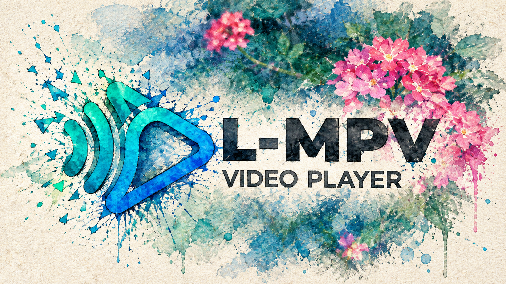
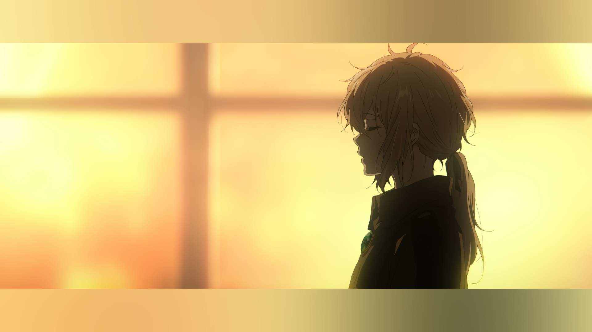
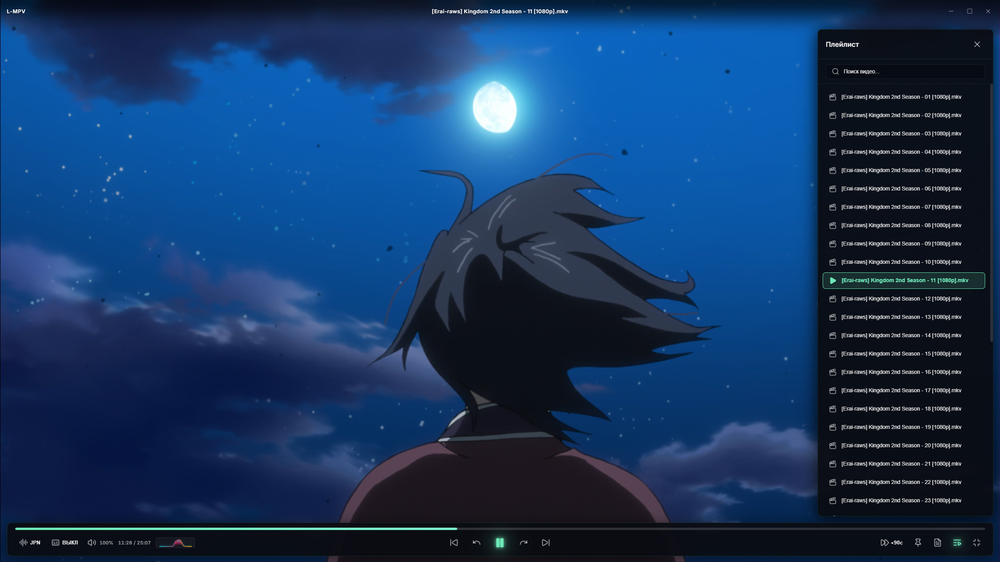
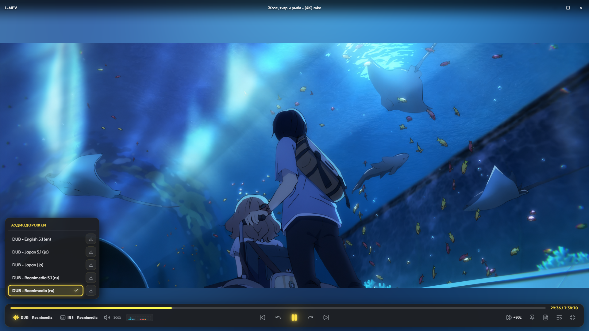
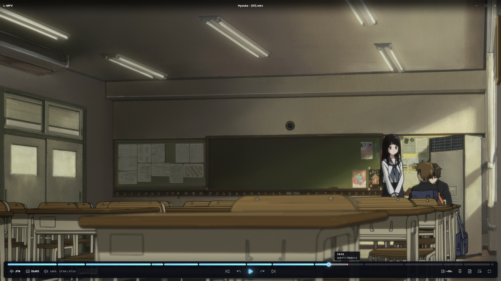
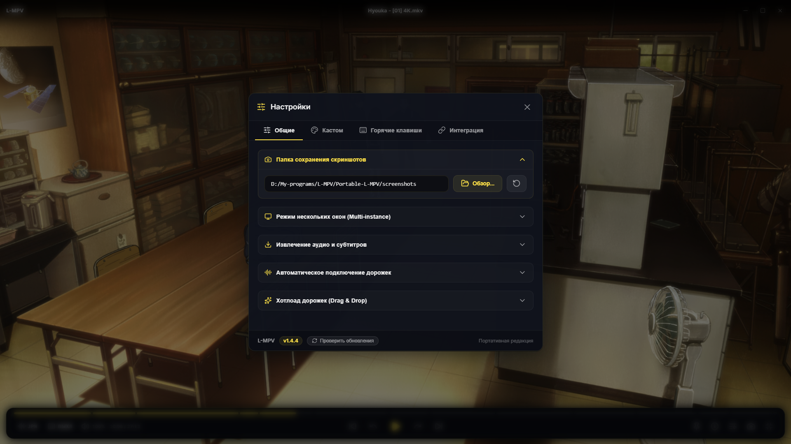
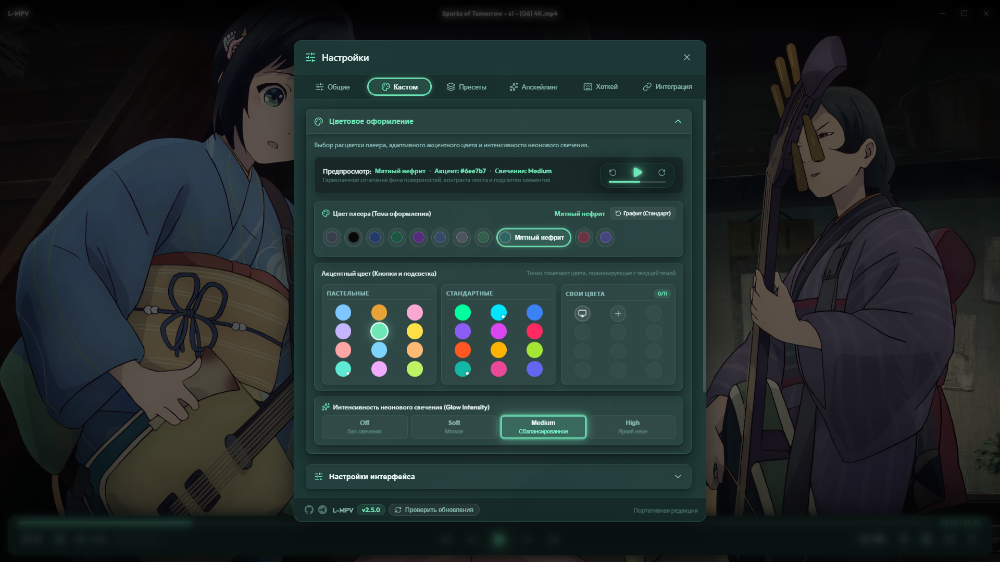
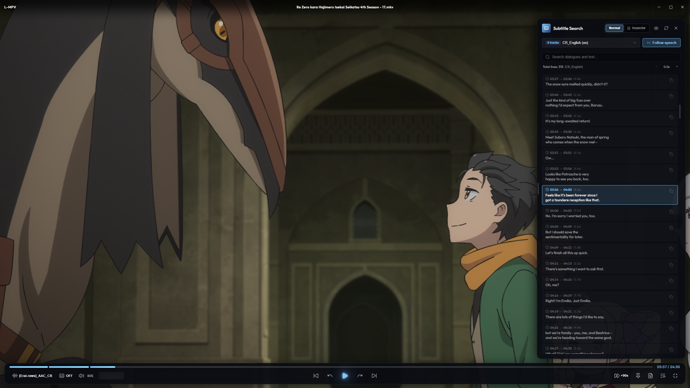
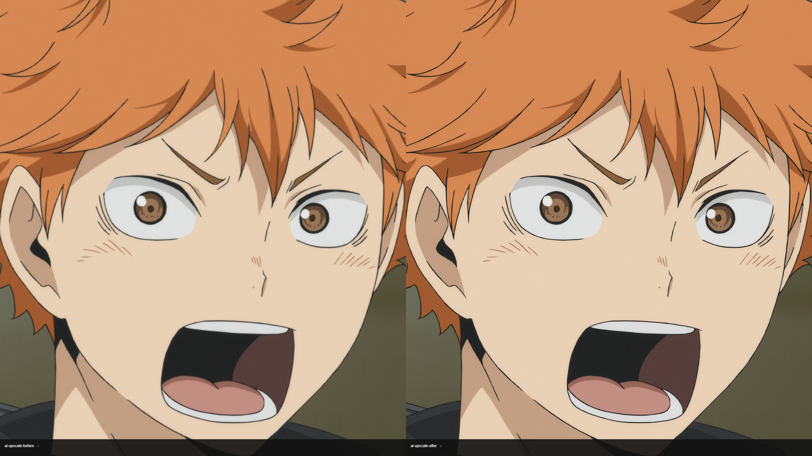

<p align="center">
  
</p>

<h1 align="center">  L-MPV — Modern & Portable Media Player</h1>

<p align="center">
  <b>A next-generation, high-performance, aesthetic, and portable media player.</b><br>
  Built on <b>Tauri v2</b>, <b>React 19</b>, <b>Direct3D 11</b>, and the native <b>libmpv</b> engine (C-FFI) with <b>Real-Time 4K AI Upscaling</b> support.
</p>

<p align="center">
  
  <a href="https://github.com/Menely/L-MPV/releases"></a>
  <a href="https://t.me/+_ngzHkrUNZs5YzQ6"></a>
  
  
  
  
  
  
  
  <a href="./LICENSE"></a>
</p>

<p align="center">
  <b>English</b> | <a href="README.ru.md">Русский</a>
</p>

---

## 🌟 About the Project

 **[L-MPV](https://t.me/+_ngzHkrUNZs5YzQ6)** is a modern desktop media player for Windows that brings together the reference-grade playback quality of the native **MPV** video engine (`vo=gpu-next`, Direct3D 11, HDR tone-mapping, WASAPI, studio-quality 32-tap sinc resampling) and hardware-accelerated **Real-Time 4K AI Upscaling** (ONNX inference via DirectML and TensorRT) with a sleek, responsive **Glassmorphic** interface crafted in **React 19** and **TypeScript**.

The player is engineered around a strict **True Portable Architecture (Zero-Install)** concept: it is completely self-contained and leaves zero footprint in system directories. All configuration files, cache, screenshots, the universal ONNX models directory (`models/onnx/`), and native binary libraries (`libmpv-2.dll`, `ffmpeg.exe`, `mediainfo.dll`) reside directly inside the application folder.

<p align="center">
  
</p>

---

## 💖 Acknowledgements

The creation and ongoing evolution of **L-MPV** have been made possible thanks to extraordinary open-source projects and talented contributors:

- **[LANKETT](https://github.com/LANKETT)** — A huge thank you to the designer for creating the signature app icon and visual brand identity!
  - GitHub: **[@LANKETT](https://github.com/LANKETT)**
  - Telegram Channel: **[LANKETT WORK](https://t.me/lankett_work)**
- **[mpv](https://mpv.io/)** ([GitHub](https://github.com/mpv-player/mpv)) — For the gold-standard, versatile, and high-performance native media engine that powers uncompromising playback quality.
- **[mpv-AnimeJaNai](https://github.com/the-database/mpv-AnimeJaNai)** & **[the-database](https://github.com/the-database)** — For the pioneering `vf_animejanai` video filter and real-time neural 4K upscaling capabilities.
- **[Tauri](https://tauri.app/)** ([GitHub](https://github.com/tauri-apps/tauri)) — For the lightweight, secure, and lightning-fast next-gen framework powered by Rust and modern web technologies.
- **[dnd-kit](https://dndkit.com/)** ([GitHub](https://github.com/clauderic/dnd-kit)) — For the modern, flexible, and high-performance Drag & Drop toolkit for React, providing intuitive interactive reordering.

---

## 📸 Interface Screenshots

<table width="100%">
  <tr>
    <td width="50%" align="center">
      <b>🌌 Hardware Letterbox Illumination</b><br>
      <sub>Shader-based video edge blurring (Ambient)</sub><br><br>
      <a href="./assets/ambient-light-demo.png"></a>
    </td>
    <td width="50%" align="center">
      <b>📑 Slide-out Playlist Drawer</b><br>
      <sub>Automatic directory scanning, filtering, and live search</sub><br><br>
      <a href="./assets/playlist-drawer.png"></a>
    </td>
  </tr>
  <tr>
    <td width="50%" align="center">
      <b>🎧 Track Management & 1-Click Export</b><br>
      <sub>Instant audio/subtitle switching and lossless extraction</sub><br><br>
      <a href="./assets/audio-window.png"></a>
    </td>
    <td width="50%" align="center">
      <b>🔖 Interactive Chapter Navigation</b><br>
      <sub>Chapter list with timestamps and active section highlight</sub><br><br>
      <a href="./assets/interface-chapter-player.png"></a>
    </td>
  </tr>
  <tr>
    <td width="50%" align="center">
      <b>⚙️ Settings Hub</b><br>
      <sub>Language selection, hotkeys, audio & subtitle controls, and context menu</sub><br><br>
      <a href="./assets/settings-general-player.png"></a>
    </td>
    <td width="50%" align="center">
      <b>🎨 Customization Suite</b><br>
      <sub>Accent color themes, 10 audio visualizer palettes</sub><br><br>
      <a href="./assets/settings-customization-player.png"></a>
    </td>
  </tr>
  <tr>
    <td width="50%" align="center">
      <b>💬 Interactive Subtitle Browser & Inspector</b><br>
      <sub>Full-text search, live speech tracking, and ASS inspector</sub><br><br>
      <a href="./assets/subtitled-window-player.png"></a>
    </td>
    <td width="50%" align="center">
      <b>⚡ Real-Time 4K AI Upscaling (Before & After)</b><br>
      <sub>Hardware-accelerated edge and texture reconstruction in real time</sub><br><br>
      <a href="./assets/ai-upscale.png"></a>
    </td>
  </tr>
</table>

---

## ✨ Key Features

<details>
<summary><b>🚀 Real-Time 4K AI Upscaling (Neural Anime & Video Upscaling)</b></summary>

<p align="center">
  
</p>

- **Native In-Stream Video Inference:** Deep integration of the `vf_animejanai` filter powered by `the-database/mpv-AnimeJaNai` and the `aji.dll` bridge, outputting real-time hardware-accelerated 4K Ultra HD frames.
- **Two Operational Modes:** A simple **"Off"** and **"AI Upscaling"** toggle in Settings (`F2`) — you decide when to engage neural enhancement.
- **Dual Inference Backends:**
  - **DirectML:** Universal DirectX 12 inference compatible with virtually all modern GPUs (AMD Radeon, Intel Arc/Iris, NVIDIA GeForce) for rock-solid stability.
  - **TensorRT:** Maximum throughput and frame rates tailored for NVIDIA GeForce RTX graphics cards (supporting architectures from `sm75` up to the latest Blackwell `sm120`).
- **Smart Component Downloader ("Download Engine"):**
  - Automatically identifies the installed GPU and downloads the matching runtime libraries.
  - Live progress display (percentages, downloaded MBs), clean extraction status, and persistent 100% completion notice for 3 seconds.
  - Non-blocking background extraction via `spawn_blocking` with zero UI freezing and no intrusive console popups.
- **TensorRT 1080p Precompilation (.engine):**
  - Background optimization of ONNX models for 1080p -> 4K upscaling with multi-stage phase tracking (ONNX parsing, CUDA tactics profiling, graph optimization, engine serialization).
  - Compiled via native `aji_harness.exe` with precise `dyn-HW` dynamic axes matching and tuning parameters.
  - Eliminates initial playback startup delays and supports one-click model recompilation.
- **Automatic FP16 Normalization & Multi-Generation Model Support (V1, V2, V3):**
  - Built-in hardware validation and ONNX data type conversion: FP32 models are automatically converted to IEEE Float16 before compilation.
  - Completely eliminates "rainbow noise" artifacts and shader memory mismatch: crystal-clear picture quality across lightweight V2 models, heavy V1 architectures, and HD V3 / V3Sharp1 checkpoints.
- **Universal ONNX Model Library (`models/onnx/`):**
  - Drop in any custom `.onnx` model files.
  - **"Open Models Folder"** button for instant access in Windows Explorer.
  - Toggle to hide or reveal model names (privacy dot masking).
  - Interactive drag-and-drop model reordering (`@dnd-kit/sortable`) via grab handles, automatically persisted in `config/models_order.json`.
  - Unified compact 24px action controls with hovering drop shadows across model cards.
  - Dedicated hotkey and mouse button assignments matching the hotkey settings tab styling with Esc cancel and click-outside dismissal.
- **On-the-Fly Neural Network Switching via Hotkeys:**
  - `Ctrl+J` — Informative OSD overlay displaying upscale status and statistics (active backend, selected model, slot index, video resolution -> 4K);
  - `Shift+1` — Disable upscaling;
  - `Shift+2` — Enable Neural Network #1;
  - `Shift+3` — Enable Neural Network #2;
  - `Shift+4` — Enable Neural Network #3;
  - Instant OSD notification showcasing the actual name of the activated model.
  - Forced frame redrawing on pause when switching models.

</details>

<details>
<summary><b>🌍 Multilingual Interface (English / Russian)</b></summary>

- **Dual language support out of the box:** The entire interface is localized in English and Russian.
- **Instant live switching:** Changing the language in settings takes effect immediately without restarting the player.
- **Smart auto-detection:** The player automatically detects and applies your Windows system language on first launch.

</details>

<details>
<summary><b>⚡ Next-Gen Video Rendering (<code>vo=gpu-next</code>) & Adaptive Window Geometry</b></summary>

- **High-Quality Pipeline:** Powered by `vo=gpu-next`, native Direct3D 11 (`gpu-api=d3d11`), hardware decoding (`hwdec=auto-safe`), and perceptual gamut mapping (`gamut-mapping-mode=perceptual`).
- **High-Precision Scaling:** Reference `scale=spline36` and `cscale=spline36` interpolation algorithms delivering razor-sharp detail and pristine color transitions.
- **Intelligent HDR & Tone Mapping:** Automatic display metadata passthrough (`target-colorspace-hint=yes`), dynamic peak brightness calculation (`hdr-compute-peak=yes`), configurable tone mapping curves (`Auto`/`Spline`, `BT.2446a`, `BT.2390`), and adjustable shadow contrast recovery (`hdr-contrast-recovery` 0% / 30% / 50%).
- **Precision Dithering & Debanding:** Configurable dither bit-depth (`Auto`, `8-bit`, `10-bit`, `Off`) and optional GPU deband shader (`deband`) with balanced presets for 8-bit SDR displays.
- **Letterbox Prevention (Zero Black Bars):** Automatic calculation of physical even pixel dimensions adhering strictly to the stream Display Aspect Ratio (DAR) with monitor DPI scaling. Window is automatically centered using `appWindow.center()` without unwanted black bars.
- **Automatic Zoom & Pan Reset:** Guarantees `video-zoom` and `video-pan` reset to 0.0 upon opening every new media file.
- **Zero-Flicker Lifecycle & Lightning Launch (< 1-2s):** The window initializes hidden, instantly reads container geometry from the demuxer, calculates true Display Aspect Ratio, centers itself, and reveals smoothly (`window.show()`) with zero stutter or flicker.
- **Direct-to-Window HWND Output:** Video renders directly into the native Win32 HWND via C-FFI with zero latency underneath a fully transparent WebView2 DOM layer (`transparent: true`).

</details>

<details>
<summary><b>🎵 Native Audio Visualizer (WASAPI Loopback Capture / FFT 1024)</b></summary>

- **Studio Spectral Analysis:** Low-overhead system audio capture via Windows WASAPI Loopback Capture in a dedicated background Rust thread, running a 1024-point Cooley-Tukey Radix-2 FFT with a Hann smoothing window.
- **32 Studio Frequency Bands:** Detailed 46.8 Hz per-bin resolution. Logarithmic band distribution spanning 25 Hz to 19,000 Hz with strictly monotonic grouping (sub-bass, punch, midrange/vocals, presence, brilliant highs).
- **5.1 / 7.1 Cinematic Surround Downmix:** Intelligent blending of LFE (subwoofer) and Center (dialogue) channels — explosions, gunfire, and atmospheric sound effects trigger punchy visualizer responses!
- **Logarithmic dBFS Scale:** -46 dB to 0 dB dynamic range with pink-noise roll-off frequency compensation (+0.75 dB/band) and independent scaling decoupled from player volume.
- **9 Visualization Styles:** Including `Waveform` (multi-layered waves with dynamic spectral harmonics), `Spectrum` (32-band equalizer), and `Bars` (Apple Music / Spotify style rhythm capsules), among others.
- **Studio Ballistics & Physics (Peak Hold & Drop):** Instant 1-frame attack and smooth gravity-accelerated decay for luminous peak markers.
- **Zero CPU Idle Footprint (0.0% CPU):** When paused, minimized, disabled, or in IDLE mode (when controls auto-hide), the capture thread enters a deep sleep without polling WASAPI.

</details>

<details>
<summary><b>🌌 Hardware Letterbox Illumination (Ambient Light / GPU Blur)</b></summary>

- **Black Bar Elimination:** When video and monitor aspect ratios differ (e.g., 21:9 on 16:9, 4:3, ultra-wide), video borders are projected and blurred across letterbox and pillarbox zones using `libplacebo` shaders with zero CPU load.
- **3 Operating Modes:**
  - `Off` — Classic black letterbox bars;
  - `Blur` — Real-time hardware shader blur with smooth radius adjustment (10px to 150px);
  - `Color` — Soft fill using the player accent color (including Windows System Accent) or any custom HEX shade.
- **60 FPS Performance:** Instant GPU preview (`apply_ambient_preview`) without blocking disk I/O, coupled with a 400ms debounced disk save.
- **Quick Access:** Toggle on the fly via hotkey `B` (`Off → Blur → Color → Off`), context menu (Right-Click), or the Settings panel.

</details>

<details>
<summary><b>🎧 Studio Audiophile Sound & 150% Volume Boost (Audiophile Profile)</b></summary>

- **Ultra-Low Latency Output:** Native Windows WASAPI driver (`ao=wasapi`) with a fine-tuned 0.2s buffer.
- **Audio Overload Peak Limiter (Zero Clipping):** Transparent `af=lavfi=[alimiter=limit=0.98]` filter prevents clipping and harsh distortions when boosting volume to 101–150%, while remaining bit-perfect transparent at 100% volume.
- **Audio Device Latency Fix:** `audio-stream-silence=yes` and `audio-wait-open=0.25` prevents sleeping DACs and Bluetooth speakers from clipping initial milliseconds without adding seek latency (`audio-buffer=0.2`).
- **Software Volume Boost (Up to 150%):** Amplify quiet dialogue and low-gain audio tracks up to 150% without clipping or harmonic distortion (`volume-max=150.0`).
- **Studio 32-Tap Sinc Resampling:** High-fidelity sinc filter (`audio-resample-filter-size=32`), 16,384 phase shifts (`audio-resample-phase-shift=14`), and linear inter-sample interpolation (`audio-resample-linear=yes`).
- **Normalized Downmix:** Safe multichannel 5.1/7.1 to stereo downmixing (`audio-normalize-downmix=yes`) with automatic headroom protection against digital clipping.
- **Pitch Correction:** Preserves natural voice pitch when altering playback speed (`audio-pitch-correction=yes`, scaletempo2).

</details>

<details>
<summary><b>🎧 Track Management & 1-Click Export (Track Popover & FFmpeg)</b></summary>

- **Ergonomic Track Popover:** Streamlined popover menu for audio and subtitles on the bottom control bar, sized to display 7 tracks cleanly, with smooth vertical scrolling and automatic scrolling to the active stream on open.
- **1-Click Audio & Subtitle Export:** Integrated download buttons within the bottom bar popover and context menu (Right-Click).
- **Direct Stream Copy (`-c copy`):** Instant track extraction without re-encoding, preserving 100% of original quality in just seconds.
- **Smart Multi-Threaded Fallback (`-threads 0`):** Automatic transcoding for incompatible container formats (e.g., `mov_text` subtitle streams convert seamlessly into `.srt`).
- **Direct Copy for External Files:** Instantly duplicates loaded external subtitles without invoking FFmpeg.
- **Flexible Output Paths:** Save extracted files alongside the video or choose any custom destination via Windows Explorer.
- **Animated Feedback:** Inline spinner inside the menu and a sleek progress status bar on the control panel.

</details>

<details>
<summary><b>💬 Interactive Subtitle Browser & Inspector (Searchable Subtitles Browser)</b></summary>

<p align="center">
  
</p>

- **Instant Full-Text Search:** Real-time searching across the entire subtitle track with instant match highlighting, match counters, and quick navigation via `Up` / `Down` / `Enter`.
- **Interactive Jump to Timestamp:** Clicking any line immediately seeks playback to the exact dialogue timestamp.
- **"Follow Playback" Mode:** Automatically tracks the active line during playback in real time with smooth, adaptive rAF-driven auto-scrolling.
- **Dual Inspection Modes:**
  - *Standard (Text)*: Clean, formatted dialogue text free of formatting tags, showing start timestamp, duration, and character/actor name.
  - *Technical (ASS Inspector)*: In-depth parsing of Advanced SubStation Alpha tags (`[Ht]` HTML preview, `[Ae]` Raw ASS), complete style badges (style name, actor, font family, font size, HEX/BGR color, MarginV/Layer, coordinates, and override tags).
- **Fine Subtitle Delay Tuning:** Micro-adjust subtitle timing offsets in 50/100 ms increments directly from the search bar.
- **Quick Track Picker:** Switch between embedded and external tracks, load new `.srt`/`.ass` files, or disable subtitles in a single click.
- **Freeform Geometry & Positioning:** Resize window width by dragging edges, move the window anywhere via header Drag & Drop, auto-adapt width per mode, and remember layout preferences.
- **Adjustable Opacity (Glass / Solid):** Toggle between a translucent Glassmorphic backdrop and a solid high-contrast dark theme for optimal readability over vibrant scenes.
- **High-Performance DOM Virtualization:** Effortlessly scrolls through thousands of subtitle lines with silky-smooth frame rates and negligible CPU usage.

</details>

<details>
<summary><b>🎨 Premium Glassmorphic UX/UI, Design System & Custom Fonts</b></summary>

- **11 Cinematic UI Themes:** *Dark Graphite*, *Discord Gray*, *Deep OLED*, *Sapphire Midnight*, *Nordic Frost*, *Lavender Indigo*, *Dark Emerald*, *Forest Sage*, *Mint Jade*, *Amethyst*, and *Sunset Coral* with interactive pill badges and harmonious palettes across backgrounds, text, surfaces, and accent glows.
- **Unified Elevation Surfaces System:**
  - *Level 1 (`.glass-panel`)*: Main floating bars, dropdown menus, and modal dialogs (`blur(28px)`).
  - *Level 2 (`.glass-section`)*: Grouping sections and functional settings containers.
  - *Level 3 (`.glass-tile`)*: Interactive option cards and neural network tiles featuring tactile hover feedback and neon active borders (`.glass-tile--active`).
- **Self-Contained Font Ecosystem & Custom Fonts (UI Font):**
  - **Complete Offline Independence & DirectWrite Crispness:** All fonts are bundled locally, eliminating external Google Fonts network calls (FOUT) and redundant GPU composite layers to deliver razor-sharp DirectWrite ClearType rendering on Full HD displays.
  - **5 Built-in Font Families:** *Inter*, *Outfit*, *Plus Jakarta Sans*, *Manrope*, *JetBrains Mono*, plus the Windows *System Default* font.
  - **Custom User Font Support:** Dedicated `fonts/` folder located right next to `l-mpv.exe`, automatically extracted on first launch or update. Simply drop in your `.ttf`, `.otf`, `.woff`, or `.woff2` files.
  - **"Open Fonts Folder" Shortcut:** The folder icon button in the Fonts header opens the directory in Windows Explorer, and the available font list refreshes automatically upon regaining window focus.
  - Seamless switching under the "Appearance" tab with automatic persistence in `localStorage`, `config/settings.json`, and cross-window synchronization.
- **Interactive Color Scheme Section:** Live authentic preview simulating player palette combinations, text contrast, and luminous element highlights.
- **Adaptive Neon Glow (Glow Intensity):** 4 illumination intensity tiers (*Off*, *Soft*, *Medium*, *Cyber Intense*) with vector `drop-shadow` diffusion and timeline backlighting.
- **Custom Color Picker & 4×4 Palette:** HSV/RGB/HEX color spectrum dialog with brightness sliders, 16 pastel presets, 16 classic presets, and a persistent user palette (up to 15 custom colors).
- **Multi-Position Time Display (6 Layout Options):**
  - Choose your ideal timestamp layout in Settings (`F2`) or the Right-Click menu:
    - *Left of Timeline* — Classic position before the seek bar.
    - *Right of Timeline* — Standard placement after the seek bar.
    - *Right of Volume Slider* — Grouped in the left toolbar next to the audio visualizer.
    - *Right Toolbar Cluster* — Placed in the right button group before utility icons (expands timeline to 100% width).
    - *Centered Over Timeline* — Floating neon pill with glass blur (`backdrop-filter: blur(12px)`) centered above the seek bar (expands timeline to 100% width).
    - *Window Titlebar* — Interactive time badge inside the top window header to the left of window controls; leaves the bottom control bar uncluttered.
  - Selecting any off-timeline position automatically expands the seek bar to span 100% of the bar width (`.timeline-row--full`).
- **4 Interactive Time Formats with 1-Click Toggle:**
  - Supports: *Elapsed / Total*, *Remaining Only*, *Estimated End Time* (adjusted for playback `speed`), and *High-Precision Milliseconds*.
  - Click directly on the timestamp anywhere in the UI to cycle through formats with an OSD confirmation.
- **Control Bar Form Factors ("Floating Island" & "Docked Bar"):**
  - Switch between an airy floating capsule offset from window borders and a monolithic docked bar spanning the full window width.
  - Detailed `148×64px` mini-previews in Settings with neon active selection outlines.
- **Ergonomic "Appearance" Tab Redesign:**
  - Top horizontal interface opacity slider (20% to 100%).
  - Responsive 3-column grid (collapses to 1 column on widths ≤ 480px): Corner Radius (2x2 cards + compact slider) | UI Scaling (2x2 cards + slider + "A" auto-scale toggle) | Typography (6 font options + custom user fonts with folder button).
  - Bottom section: Control bar style with visual mini-previews (left) + compact grids for Time Position (3x2) and Time Format (2x2) (right).
- **Dynamic Corner Radius System (UI Corner Radius):** 4 rounding levels (*Square 0px*, *Subtle 8px*, *Rounded 14px*, *Pill 20px*) applied instantly across all windows, buttons, and glass tiles.
- **Floating Quick-Control Pill:** Minimalist bottom toolbar with accent lighting, quick-access audio, subtitles, chapters, screenshots, speed controls, and playlist drawer.
- **Subtle Vector Contour Glow (Vector Drop-Shadow):** Precise light diffusion wrapping vector SVG icons with smooth gradient falloff, avoiding muddy circular halos.
- **Container Query Responsiveness:** Multi-stage intelligent compression hiding verbose track labels and scaling down the audio visualizer and secondary controls on narrow windows.
- **Smart Fullscreen Auto-Hide:** Option to immediately conceal all UI elements when moving the cursor near the top edge of the display.

</details>

<details>
<summary><b>⚙️ Settings Interface: Sidebar Panel or Modal Dialog</b></summary>

- **Two Form Factors, One Codebase:** Choose your preferred layout (Sidebar drawer or centered modal dialog) under "Appearance"; your selection is saved and applied immediately without restarting the player.
- **Context Preservation Across Layouts:** Active category, tab, expanded accordions, scroll position, and draft preset name seamlessly persist when switching between Sidebar and Modal views.
- **True Display Scaling:** Panel width is computed from actual window dimensions factoring in `UI Scale`, ensuring perfect proportions on 2K/4K high-DPI displays.
- **Exclusive Single-Accordion Mode:** Expanding any settings category automatically and smoothly collapses sibling categories, maintaining a clean and focused workspace in both Sidebar and Modal layouts.
- **Adaptive Settings Grids:** Blocks dynamically collapse from three columns to single-column layouts on compact windows without label truncation or slider clipping.
- **Video & Audio Settings Section:** Dedicated accordion in the General tab, laid out as four compact tiles in a two-column grid. *Frame Processing* (deinterlacing `no`/`auto`/`yadif`/`yadif2x`, hardware decoding `auto-safe`/`auto-copy`/`no`), *Audio Path* (peak limiter, volume normalization `dynaudnorm`/`loudnorm`, device latency fix), *Color and Artifacts* (HDR tone mapping, contrast recovery, dither depth, debanding with strength presets), and *Data Buffer* (50–1024 MB). The icon lives on the tile only, and every segment block has a reset-to-default button plus a hover tooltip.

</details>

<details>
<summary><b>✨ Interactive Timeline: Neon Pulse Wave & Live Scrubbing</b></summary>

- **Kinematic Neon Pulse Wave:** Compact glowing neon ring expanding from the click point along the progress track, styled to match the active player accent theme. Automatically suppressed when animations are disabled, so the ring can never linger over the control buttons.
- **Unthrottled Live Scrubbing:** Ultra-responsive `pointermove` handling delivering silky smooth scrubbing without micro-stutters, fully optimized for high refresh rate (144Hz+) gaming monitors.
- **Artifact-Free Instant Seeking (Anti-Flicker):** While dragging, the timeline uses lightweight `absolute+keyframes` preview seeks that skip intermediate frame decoding; a single precise `absolute+exact` seek lands on the exact frame once you release. This removes decoder overload, torn frames and UI desync on slower hardware.
- **Pixel-Accurate Release Geometry:** The final seek position is computed from a freshly measured track rectangle (invalidated on window resize), so auto window resizing can no longer misplace the playhead.
- **No Stray Focus Ring:** Clicking the timeline no longer leaves a green `:focus-visible` outline floating over the video; keyboard focus indication is preserved via the progress track growing from 5px to 8px.

</details>

<details>
<summary><b>🔍 Hardware Zoom & Pan & Mouse Wheel Controls</b></summary>

- **Silky Smooth Frame Scaling:** Cursor-centered zooming via `Ctrl` + Mouse Wheel at up to 60 FPS.
- **Magnetic Snap:** Automatically snaps to native scale (100%) when approaching zero zoom.
- **Instant Reset:** Return to 100% scale and center position instantly with `Ctrl + 0`.
- **Volume Wheel Control:** Scrolling the wheel over video without holding `Ctrl` adjusts volume smoothly (up to 150%) in 5% increments with automatic persistence.

</details>

<details>
<summary><b>🖥️ Smart Fullscreen & Window Management</b></summary>

- **True Fullscreen Mode:** Reliable Windows taskbar suppression via Win32 `HWND_TOPMOST` and DWM Cloaking without frame-offset stutter (0, 0).
- **Dynamic Z-Order Management (`handle_window_focus`):** When switching tasks (`Alt+Tab`), the player releases Topmost status so other applications open smoothly over it, and restores it immediately upon regaining focus.
- **Always on Top:** Keep the player window over other apps with hotkey `T` or the titlebar pin icon.
- **Clean Process Lifecycle:** Zero dangling background processes — `l-mpv.exe` terminates cleanly and immediately from Windows Task Manager on exit.
- **Video Frame Scaling & Rotation:** Scale the frame in the window three ways — *Stretch to window size* (fills the window ignoring proportions), *Fit inside window* (whole frame visible, letterbox/pillarbox bars), *Fill screen and crop frame* (fills the window, edges cropped) — plus rotation by 0°, 90°, 180°, or 270°. The active mode is read back from mpv and marked in the context menu.

</details>

<details>
<summary><b>📋 Clipboard Integration & Clean Screenshots</b></summary>

- **Frame to Clipboard via `Ctrl + C`:** Capture the current video frame without OSD directly into the Windows clipboard via native `copy_frame_to_clipboard` (zero temporary disk files).
- **Lossless Screenshots:** Save high-quality PNG snapshots using hotkey `S` or the camera icon with instant OSD confirmation.
- **Custom Directory:** Set a custom screenshots directory in Settings or reset to the local `screenshots/` folder.

</details>

<details>
<summary><b>📑 Smart Playlist & File Navigation</b></summary>

- **Auto-Playlist with Natural Sort:** Opening a file automatically populates the playlist with all sibling media in the directory, ordered by natural human numerical sorting.
- **Slide-out Playlist Drawer (`L` / `P`):** Instant search, file filtering, active track highlighting, and one-click playback switching.
- **Drag & Drop:** Drop local media files or streaming URLs directly into the player window.
- **Loop Modes & Shuffle:** Loop current file, loop entire playlist, or play in random order. The toolbar button and the *Repeat Mode* submenu share a single `set_repeat_mode` command that always sets both loop properties together; the submenu marks the active mode immediately and confirms the change with an OSD toast.
- **Chapter Navigation:** Interactive chapters modal with timestamps and jump-to-chapter shortcuts.
- **Resume Playback:** Robust playback resume saving progress for **up to 300 files** in local `config/history.json`. Seamless start strictly from the saved timestamp, audio/video synchronization without premature audio desync (`hr-seek-framedrop=no`), rapid-exit safety, and preservation of actual watch progress even if interrupted before previous records.
- **Windows Taskbar Progress:** Displays playback progress bars directly over the player's icon in the Windows taskbar.

</details>

<details>
<summary><b>⚙️ Hybrid Input Customization System</b></summary>

- **Full Hotkey Rebinding:** Configure keyboard shortcuts with modifiers (`Ctrl`, `Shift`, `Alt`) and mouse inputs (`MouseLeft`, `MouseRight`, `MouseMiddle`, `MouseLeftDoubleClick`).
- **Granular Actions:** Separate binds for cycling tracks via click vs. opening their respective selection popovers.
- **Per-Action Reset:** Individual "Reset to Default" button next to every action entry.
- **File Associations:** One-click registration in Windows Registry and shortcut to Windows "Default Apps" settings.

</details>

<details>
<summary><b>📊 Media Container Property Inspector (MediaInfo.dll C-API)</b></summary>

- **Native In-Memory Inspection:** Direct C-FFI binding to `mediainfo.dll` via `libloading` for instant comprehensive extraction of video, audio, and subtitle streams without external command-line shells.
- **Independent Desktop Window (655×685 px):** The MediaInfo window moves freely across monitors beyond the main player; launches over the player (`Shift+F10`) with an Always-on-Top pin button (`alwaysOnTop`).
- **Standalone File Inspection ("Open with L-MPV MediaInfo"):** Inspect media metadata straight from the Windows Explorer context menu without launching the video player.
- **Interactive Stream Filter Tabs (Quick Filter):** Filter tracks instantly (*"All"*, *"General"*, *"Video"*, *"Audio"*, *"Subtitles"*, *"Chapters"*) with informative stream count badges and 6px rounded pills matching the design system.
- **Collapsible Stream Accordions:** Collapse or expand individual streams or all at once ("Expand/Collapse All"), with auto-expansion during `Ctrl+F` search.
- **Native Drag-and-Drop:** Drop any media file straight into the open MediaInfo window with a translucent overlay (`FileUp`) for instant analysis.
- **Real-Time Bitrate Telemetry (Bitrate Sparkline):** Live interactive graph tracking incoming video and audio bitrates, demuxer cache depth, buffer metrics, and hardware decoder performance.
- **Productivity Features:** Instant property search with highlighting (`Ctrl+F`), export to `.txt`, copy to clipboard, and bilingual interface (EN/RU).

</details>

<details>
<summary><b>📁 Modular Presets System & Configuration Files</b></summary>

- **Individual Preset Files (`config/presets/<name>.json`):** Every user preset is stored as an independent JSON file in the portable directory, preventing configuration collisions. Easily share, copy, and back up presets via Explorer.
- **Native Export & Import:** Windows Explorer system dialogs (`save` / `open`) to export presets anywhere on your drive or import shared community styles.
- **Quick Explorer Access:** The "Open Folder" button opens `config/presets/` in Windows Explorer with one click.
- **Live Auto-Synchronization:** Preset lists refresh instantly whenever the player regains focus (e.g., after modifying `.json` files manually) or via the refresh button.

</details>

<details>
<summary><b>🖱️ Customizable Context Menu (Right-Click) & Drag-and-Drop Editor</b></summary>

- **Interactive Drag-and-Drop Editor:** Visual layout customizer under Settings (`F2` -> "General" -> "Context Menu") powered by `@dnd-kit`, supporting dragging via grab handles or the entire card.
- **22 Functional Actions & Submenus:** Manage audio and subtitle tracks, chapters, speed, aspect ratios, rotation, ambient lighting, MediaInfo, sleep timer, and visual style presets.
- **Dynamic Smart Submenus:**
  - *"Style Presets"*: Browse user presets and pre-packaged styles with active indicators.
  - *"AI Upscaling"*: Quick toggle and instant model selector scanning `models/onnx/`.
  - *"Control Bar Buttons"*: 10 individual visibility toggles for bottom toolbar icons.
- **Menu Dividers (`divider`):** Insert clean separator lines anywhere to organize your menu items.
- **Portable Storage (`config/context_menu.json`):** Custom menu layouts are stored locally in the player directory. A one-click "Reset" button restores default factory ordering at any time.

</details>

<details>
<summary><b>🛡️ Architectural Reliability: Atomic Writes, Anti-Stuttering & Process Ownership (v2.6.0)</b></summary>

- **Thread Prioritization & Anti-Stuttering (Windows MMCSS):**
  - Option `vo-mmcss-profile=Playback` registers the video rendering thread with the Windows Multimedia Class Scheduler Service (MMCSS), ensuring prioritized CPU quantum allocation and eliminating video frame drops under background OS load (Defender, browser, indexing).
  - Raised process priority (`priority=abovenormal`) over standard background applications.
- **Two-Phase Atomic Commit (`write_atomic`):**
  - Zero config corruption: configuration files are written to a temporary `.{stem}.{pid}.{counter}.tmp` file, flushed to physical disk via `File::sync_all()`, and atomically replaced via WinAPI `MoveFileExW` (`MOVEFILE_REPLACE_EXISTING | MOVEFILE_WRITE_THROUGH`).
  - Covers settings (`settings.json`), playback history (`history.json`), presets (`presets/*.json`), context menu layout (`context_menu.json`), and subtitles cache.
- **Automatic Backup Rotation (`prune_backups`):**
  - Before modifying configuration files, a timestamped snapshot is archived to `config/backups/<filename>.<timestamp_ms>.bak`. Retains up to **10 recent backups** automatically, safely pruning older copies.
- **Subprocess Ownership & Strict Timeouts:**
  - Zero zombie processes: all FFmpeg tasks employ `kill_on_drop(true)` — closing the player cleanly terminates background extraction workers.
  - Hard timeouts on external CLI utilities: `nvidia-smi` (4s), `tar.exe` archive extraction (120s), and TensorRT engine builds (15 min).
  - VRAM safety guard: atomic `COMPILATION_ACTIVE` flag prevents concurrent compilation of multiple TensorRT engines.

</details>

<details>
<summary><b>🔄 Update Integrity Verification & Seamless Rollback (BLAKE3 & Checksums) (v2.6.0)</b></summary>

- **Cryptographic Integrity Verification (BLAKE3):**
  - Automatically verifies hashes of downloaded binaries and libraries (`l-mpv.exe`, `libmpv-2.dll`, `mediainfo.dll`) on the fly, rejecting corrupted or partially downloaded assets before installation.
- **User-Facing `checksums.json` Manifest:**
  - Validated manifests are copied directly into the user's portable player directory upon update (`b3sum --check checksums.json`), as well as pre-packaged inside `L-MPV-v*-portable.zip`.
- **Built-in Legacy Hashes for Instant Rollback (v2.0.0 – v2.5.6):**
  - Historical BLAKE3 checksums are embedded in `updater.rs`, enabling seamless and secure rollback to older releases without modifying historical GitHub releases.
- **Renamed Executable Support:**
  - If the user renames the player executable (e.g. `L-MPV.exe`), the updater automatically syncs the binary name before replacing it, ensuring smooth in-place upgrades.

</details>

<details>
<summary><b>🎛️ Modular Audio Processing Pipeline, Dynamic Normalization & Night Mode</b></summary>

- **Dedicated Isolated Module `audio_filter.rs`:**
  - Lavfi audio filter construction and validation logic has been completely decoupled from the low-level `mpv_manager.rs` into a pure, clean Rust module.
  - Strongly typed `AudioNormalizeMode` (`Off`, `Dynamic`, `Night`) with automatic string parsing, guaranteeing zero risk of UI state desynchronization.
  - High-performance `AudioFilterChainBuilder`: filter chain assembly compiles to pure `&'static str` with zero heap allocations (Zero-Heap Allocation).
- **Cinematic Night Mode (Night DRC Mode):**
  - Powered by an optimized fast RMS compressor: `acompressor=threshold=0.25:ratio=3:attack=10:release=450:makeup=1:knee=2:link=maximum:detection=rms`.
  - The compression threshold `threshold=0.25` (-12 dBFS) and soft knee `knee=2` sit strictly above the speech frequency spectrum (-27..-18 dBFS). **Dialogue retains 100% of its original loudness and clarity (0.0 dB alteration)**.
  - Sudden loud explosions and gunshots are gently compressed by ~5 dB at a 3:1 ratio, while a 450 ms release time prevents noticeable pumping.
- **Dynamic Audio Normalization:**
  - Balanced Gaussian filter: `dynaudnorm=framelen=500:gausssize=15:maxgain=3.5:peak=0.90:compress=8:threshold=0.008:overlap=0.5`.
  - The 7.5s Gaussian smoothing window prevents modulation between individual words and completely eliminates dialogue dips after explosions — normal speech volume recovers smoothly within 2–3 seconds.
  - Noise cutoff threshold `threshold=0.008` (-42 dBFS) boosts even quiet whispers without amplifying digital silence noise, while `maxgain=3.5` (+10.9 dB ceiling) improves intelligibility without distortion.
- **Full Audio Pipeline Decoupling (6-State Matrix):**
  - Normalization modes and audio overload protection (True Peak Limiter `alimiter`) operate completely independently: disabling the limiter no longer disables or locks the normalization buttons in the UI.
  - When both switches are disabled, the `af` property is cleared (`af=""`), ensuring a pure bit-perfect bypass audio path.

</details>

---

## 🏗️ Technology Stack

<table>
  <tr>
    <th>Tier</th>
    <th>Technology Stack</th>
    <th>Purpose</th>
  </tr>
  <tr>
    <td><b>Frontend</b></td>
    <td>React 19, TypeScript 5.8, Vite 7, Lucide Icons, Vanilla CSS</td>
    <td>Ultra-fast Glassmorphic interface, CSS Custom Properties design system, micro-animations</td>
  </tr>
  <tr>
    <td><b>DnD Engine</b></td>
    <td><code>@dnd-kit/core</code>, <code>@dnd-kit/sortable</code></td>
    <td>Tactile drag-and-drop menu customization with custom sensors decoupled from Pointer Events</td>
  </tr>
  <tr>
    <td><b>Backend & Shell</b></td>
    <td>Rust (2021 edition), Tauri v2, Tokio</td>
    <td>Low-level Win32 API integration, multi-threaded IPC bridge, window management, and DWM</td>
  </tr>
  <tr>
    <td><b>Media Engine</b></td>
    <td><code>libmpv-2.dll</code> (built from <code>the-database/mpv-winbuild</code>) via dynamic FFI (<code>libloading</code>)</td>
    <td>Hardware rendering with <code>vo=gpu-next</code>, Direct3D 11, HDR tone-mapping, demuxing</td>
  </tr>
  <tr>
    <td><b>AI Upscaling</b></td>
    <td><code>vf_animejanai</code> + <code>aji.dll</code> (DirectML / TensorRT) + ONNX</td>
    <td>Real-time hardware-accelerated 4K video upscaling across any GPU</td>
  </tr>
  <tr>
    <td><b>MediaInfo Engine</b></td>
    <td><code>mediainfo.dll</code> via dynamic C-FFI</td>
    <td>Extracts comprehensive technical metadata on media containers and stream parameters</td>
  </tr>
  <tr>
    <td><b>Audio Engine</b></td>
    <td>Windows WASAPI, 32-tap Sinc Resampler, Scaletempo2</td>
    <td>Studio-grade 32-tap sinc resampling, safe 5.1/7.1 to stereo downmix, pitch correction</td>
  </tr>
  <tr>
    <td><b>Track Extraction</b></td>
    <td>Bundled FFmpeg (<code>ffmpeg.exe</code>)</td>
    <td>Direct stream copy export (<code>-c copy</code>) and smart fallback transcoding</td>
  </tr>
  <tr>
    <td><b>Platform</b></td>
    <td>Windows 10 / 11 x64</td>
    <td>Hardware acceleration via DXVA2/D3D11VA, Windows Explorer Context Menu API, Taskbar API</td>
  </tr>
</table>

---

## 📂 Project Structure

```text
L-MPV/
├── assets/                               # Static images and banners
├── src/                                  # Frontend (React 19 + TypeScript)
│   ├── assets/                           # Local fonts (Inter, JetBrainsMono, Manrope, Outfit, PlusJakartaSans)
│   ├── components/                       # UI components (feature folders with barrel index.ts)
│   │   ├── player/                       # Player shell: Titlebar, PlayerControls, Timeline,
│   │   │                                # TimeDisplay, ContextMenu, PlaylistDrawer, AudioVisualizer
│   │   ├── modals/                       # Windows: SettingsModal, MediaInfoModal (compact info overlay with bitrate Sparkline, color space & true source bit depth),
│   │   │                                # StandaloneMediaInfoWindow (655x685), ChaptersModal, UpdateModal, ColorPickerModal;
│   │   │                                # mediainfo/ module (MediaInfoTabsBar, MediaInfoSectionList, useMediaInfoDragDrop)
│   │   ├── common/                       # Reusable components: MarkdownRenderer
│   │   ├── settings/                     # Settings hub: SettingsPanel (Sidebar layout) + tabs & sections
│   │   │   ├── SettingsPanel.tsx          # Sidebar layout: adaptive geometry, scroll-spy, lazy tab mounting
│   │   │   ├── tabs/                      # Settings tabs:
│   │   │   │   ├── GeneralSettingsTab.tsx    # General settings (screenshots, playback, audio/sub titles on panel, context menu)
│   │   │   │   ├── AppearanceSettingsTab.tsx # Ergonomic styling: themes, opacity, radius, scale, fonts, panel style, 6 time slots, 4 formats
│   │   │   │   ├── HotkeysSettingsTab.tsx    # Keyboard and mouse shortcut remapping
│   │   │   │   ├── IntegrationSettingsTab.tsx # Windows system integration and file associations
│   │   │   │   └── ContextMenuSettingsTab.tsx # Visual Drag-and-Drop context menu customizer (@dnd-kit)
│   │   │   ├── sections/                  # Settings sections:
│   │   │   │   ├── PresetsSection.tsx        # Presets manager ("My Presets" and "Built-in Styles") with unified controls
│   │   │   │   ├── UpscalingSettingsSection.tsx # 4K AI upscaling controls (DirectML/TensorRT, ONNX library, mouse ordering, hotkeys)
│   │   │   │   └── VisualizerSettingsSection.tsx # Audio visualizer options (modes, styles, ballistics)
│   │   │   ├── components/                # Reusable settings components:
│   │   │   │   ├── AccordionSection.tsx      # Reusable collapsible settings section
│   │   │   │   ├── SettingBlocks.tsx         # Foundational layout blocks and EmptyState components
│   │   │   │   ├── ColorSchemeSection.tsx    # Accent color scheme customizer with live preview
│   │   │   │   ├── ControlButtonsPreviewCard.tsx # Live preview of toolbar control buttons
│   │   │   │   ├── VisualizerPreviewCard.tsx # Interactive visualizer preview card (Canvas + FFT rhythm generator)
│   │   │   │   ├── ContextMenuEntryCard.tsx  # Draggable menu item card
│   │   │   │   ├── OptionTile.tsx           # Reusable settings tiles: OptionCard, OptionBlock (segment grid + reset), OptionToggleRow
│   │   │   │   └── optionCardStyles.ts       # Shared styling definitions for option cards
│   │   │   ├── appearance/                # Appearance tab primitives:
│   │   │   │   └── ambientPrimitives.tsx     # VerticalSlider, AmbientTuneRow, getAmbientPreviewColor (extracted from AppearanceSettingsTab)
│   │   │   └── lib/                       # Settings infrastructure:
│   │   │       ├── settingsViewSession.ts     # Shared state across layouts (active section, tab, scroll position, preset draft)
│   │   │       ├── settingsTabPreload.ts     # Cold-data caching for heavy tabs (presets, upscale status)
│   │   │       ├── useSettingsTabTransition.ts # Tab transition animation orchestrator
│   │   │       └── visualizerConstants.ts    # Visualizer defaults and constants
│   │   ├── upscale/                      # Modular AI upscaling subcomponents:
│   │   │   ├── types.ts                  # Data models and progress event contracts
│   │   │   ├── GpuHardwareCard.tsx       # Detected GPU telemetry card (VRAM, architecture, recommendations)
│   │   │   ├── BackendSelector.tsx       # DirectML / TensorRT selector, engine downloader, removal, progress display
│   │   │   ├── ModelListItem.tsx         # Neural model item card with drag handles (@dnd-kit/sortable), 24px height & React.memo
│   │   │   ├── ModelTensorRtAction.tsx   # 1080p readiness status, compile micro-progressbar, 24px build/recompile buttons (React.memo)
│   │   │   └── ModelHotkeyButton.tsx     # Compact hotkey assignment button matching hotkey settings design (React.memo)
│   │   ├── subtitles/                    # Subtitle browser: SubtitlesSearchModal (root container),
│   │   │                                # rows, header, search bar, badges, TrackPicker, hooks/ (6 custom hooks:
│   │   │                                # useSubtitlesAnalysis, useModalGeometry, useActiveLineIndex,
│   │   │                                # useFollowPlayback, useSearchNavigation, usePersistentState)
│   │   ├── contexts/                         # Reactive application state contexts
│   │   │   └── PlayerStateContext.tsx        # Tri-level context: PlayerStateContext + LiveStateContext + PlayerProgressContext
│   │   ├── i18n/                             # Localization system (EN/RU)
│   │   │   ├── LanguageContext.tsx           # Language provider and useTranslation hook
│   │   │   ├── types.ts                      # Dictionary typings and translation keys
│   │   │   ├── index.ts                      # Re-exports and helpers (getDict, getEffectiveLocale, saveLocale)
│   │   │   └── locales/                      # Dictionaries: en.ts / ru.ts
│   │   ├── styles/                           # Modular CSS architecture (17 Vanilla CSS modules)
│   │   │   ├── fonts.css                     # Local @font-face declarations for bundled typography
│   │   │   ├── variables.css                 # CSS variables, color palettes, UI Scale, glow metrics
│   │   │   ├── components.css                # Design system (.glass-panel, .glass-section, .glass-tile, .btn, .badge)
│   │   │   ├── base.css                      # Global resets, IDLE state, OSD notifications
│   │   │   ├── titlebar.css                  # Window header and titlebar time badge
│   │   │   ├── video-area.css                # Video viewport geometry
│   │   │   ├── controls.css                  # Control bar, seekbar timeline, floating time badge, volume slider
│   │   │   ├── visualizer.css                # Audio visualizer styles (above timeline and toolbar)
│   │   │   ├── presets.css                   # Presets manager styling
│   │   │   ├── context-menu.css              # Right-click context menu styling
│   │   │   ├── modals.css                    # Modal dialogs (Settings with ergonomic grids, MediaInfo, Chapters)
│   │   │   ├── mediainfo-modal.css           # Styling for custom window and modal MediaInfo inspection
│   │   │   ├── side-panel.css                # Chapters drawer panel
│   │   │   ├── track-popover.css             # Audio and subtitle track popovers
│   │   │   ├── overlays.css                  # Overlay elements (Drag&Drop, Playlist Drawer, etc.)
│   │   │   ├── settings-panel.css            # Sidebar settings layout: adaptive padding, control bar docking, header offset
│   │   │   └── responsive.css                # Responsive layout rules and media queries
│   │   ├── utils/                            # Utility modules
│   │   │   ├── contextMenuRegistry.ts        # Typed registry of 22 available menu actions
│   │   │   ├── contextMenuLayout.ts          # Menu layout persistence and sync (config/context_menu.json)
│   │   │   ├── timePositionUtils.ts          # 6 time placement strategies (timeline, toolbar, floating pill, Titlebar)
│   │   │   ├── timeFormatUtils.ts            # 4 time display formats (elapsed/total, remaining, end time, milliseconds)
│   │   │   ├── controlBarStyleUtils.ts       # Control bar styling options ("Floating Island" and "Docked Bar")
│   │   │   ├── uiThemeUtils.ts               # Corner radius, scale (UI Scale), opacity (--ui-opacity/--bg-glass), and typography
│   │   │   ├── uiSettingsSync.ts             # DOM synchronization for system CSS variables, palettes, and themes
│   │   │   ├── colorUtils.ts                 # Color themes, gradient generators, and HSL/RGB conversion utilities
│   │   │   ├── hotkeyUtils.ts                # Action registry, keybinding dispatcher, and local storage persistence
│   │   │   ├── mediaInfoParser.ts            # MediaInfo parsing and localized property translation module
│   │   │   ├── presetsUtils.ts               # Preset creation, import, export, and validation utilities
│   │   │   ├── recentFilesUtils.ts           # Recent files tracking and local history synchronization
│   │   │   └── timeUtils.ts                  # High-precision timestamp formatting utilities
│   │   ├── hooks/                            # Custom React hooks
│   │   │   ├── useVideoMargin.ts             # Video viewport margin calculation hook (reserved)
│   │   │   └── useOsd.ts                     # Centralized On-Screen Display (OSD) notification hook
│   │   ├── App.tsx                           # Main container (IDLE, Hotkeys, Zoom/Pan, Drag&Drop, modals; uses useOsd); statically loads settings
│   │   ├── index.css                         # Central stylesheet import hub
│   │   └── main.tsx                          # React entry point (imports index.css and settings-panel.css)
├── src-tauri/                            # Backend (Rust + Tauri v2)
│   ├── src/
│   │   ├── main.rs                       # Application entry point
│   │   ├── lib.rs                        # Tauri initialization, HWND binding, WebView2 isolation, IPC command registry
│   │   ├── commands/                     # Modular IPC #[tauri::command] handlers:
│   │   │   ├── mod.rs                    # Re-export of all IPC command submodules
│   │   │   ├── dir_scan.rs               # Single-pass directory listing + generation counters for async folder loading
│   │   │   ├── types.rs                  # Shared DTOs and data schemas exchanged with frontend
│   │   │   ├── playback.rs               # Playback controls, navigation, volume, speed, screenshot capture
│   │   │   ├── tracks.rs                 # Audio/video/subtitle track selection and FFmpeg export
│   │   │   ├── subtitles.rs              # ASS/SRT/VTT subtitle parsing, search, timing offsets, and styling
│   │   │   ├── system.rs                 # System integration, window management, file dialogs, registry associations
│   │   │   ├── config.rs                 # Atomic loading and persistence of AppSettings (config/settings.json)
│   │   │   ├── presets.rs                # Saving, loading, importing, and exporting configuration presets
│   │   │   ├── playlist.rs               # Playlist management, folder traversal, Natural Sort
│   │   │   └── history.rs                # Persistent playback history and timestamps (config/history.json)
│   │   ├── upscale/                      # Modular 4K AI upscaling subsystem:
│   │   │   ├── mod.rs                    # Subsystem facade, IPC commands, unit tests
│   │   │   ├── types.rs                  # Data models: ModelFileItem, UpscaleSettings, GpuHardwareInfo, Progress
│   │   │   ├── hardware.rs               # GPU hardware profiling via Win32 DXGI, NVIDIA SM architecture detection
│   │   │   ├── config.rs                 # Path resolution, runtime DLL PATH injection, models/onnx/ scanner, upscale.conf
│   │   │   ├── downloader.rs             # Asynchronous streaming downloader for DirectML/TensorRT, archive extraction
│   │   │   ├── engine_builder.rs         # TensorRT (.engine) compiler, automatic FP32 to FP16 conversion, aji_harness & trtexec
│   │   │   └── controller.rs             # libmpv filter management, background TensorRT engine compilation, hotkey actions
│   │   ├── ambient.rs                    # Letterbox illumination controller (Blur / Color / Off)
│   │   ├── audio_capture.rs              # Low-latency WASAPI Loopback audio capture, fast Radix-2 FFT, 32 frequency bands
│   │   ├── fonts_bundle.rs               # Self-extracting font installer, Win32 GDI registration, font enumeration IPC
│   │   ├── mediainfo.rs                  # Dynamic FFI integration with mediainfo.dll and standalone inspection window
│   │   ├── mpv_manager.rs                # libmpv FFI wrapper (vo=gpu-next, WASAPI, D3D11, vf_animejanai, sinc filtering)
│   │   ├── system_integration.rs         # Windows Explorer integration (context menu, file type associations)
│   │   └── updater.rs                    # Background and manual self-update module
│   ├── capabilities/default.json         # Tauri v2 security and permission manifest
│   ├── icons/                            # Application icons
│   ├── nsis/                             # NSIS installer configuration and hooks
│   ├── build.rs                          # Tauri build script
│   ├── Cargo.toml                        # Rust backend package manifest and dependencies
│   ├── tauri.conf.json                   # Tauri v2 project configuration
│   └── binaries/                         # Native binary dependencies for dev and bundling (gitignored):
│       ├── libmpv-2.dll                  # MPV media engine library (with integrated vf_animejanai filter)
│       ├── mediainfo.dll                 # MediaInfo detailed stream inspection library
│       └── ffmpeg.exe                    # Lossless stream extraction executable
├── tools/                                # Auxiliary automation scripts
│   └── build_check.bat                   # Rapid backend cargo check script
├── docs/
│   └── archive/old-banners/              # Historical banner artwork archive
├── scripts/                              # Python utilities (convert_fp16.py — converts ONNX models to FP16)
├── models/                               # Neural network directories
│   └── onnx/                             # Universal directory for user-provided ONNX models
├── inference/                            # Inference runtime libraries (aji.dll, DirectML, TensorRT)
└── Portable-L-MPV/                       # Standalone portable distribution folder
    ├── L-MPV.exe                         # Main executable
    ├── libmpv-2.dll                      # Native MPV media engine (with vf_animejanai support)
    ├── mediainfo.dll                     # Native MediaInfo inspection library
    ├── ffmpeg.exe                        # Bundled module for direct stream export
    ├── models/onnx/                      # Directory for user-provided ONNX models
    ├── inference/                        # Inference runtime libraries
    ├── config/                           # Local configuration files (settings.json, context_menu.json, presets/...)
    ├── data/                             # Application state (data/webview/ — WebView2 profile, data/thumbs/ — thumbnail cache)
    ├── logs/                             # Local diagnostic logs (mpv.log, crash.log)
    └── screenshots/                      # Default directory for saved screenshots
```

---

## ⌨️ Default Hotkeys

Every keyboard shortcut and mouse button action can be customized to your preference in **Settings** (*Hotkeys*).

| Category | Action | Default Hotkey |
| :--- | :--- | :--- |
| **4K AI Upscaling** | Disable Upscaling | `Shift + 1` |
| | Enable Neural Model #1 | `Shift + 2` |
| | Enable Neural Model #2 | `Shift + 3` |
| | Enable Neural Model #3 | `Shift + 4` |
| **Playback** | Play / Pause | `Space` or Left Click on video |
| | Repeat Mode (Loop) | `R` |
| | Shuffle Mode | Bottom bar shuffle button |
| **Seeking** | Seek backward / forward (5 sec) | `←` / `→` |
| | Seek backward / forward (10 sec) | `-10` / `+10` buttons on bottom bar |
| | Frame step backward / forward | `,` / `.` |
| **Audio** | Volume ±5% | `↑` / `↓` or Mouse Wheel over video |
| | Mute / Unmute | `M` |
| | Cycle Audio Track | `A` or Left Click Audio button |
| | Audio Track Popover & Export | Right Click Audio button |
| **Subtitles** | Cycle Subtitle Track | `V` or Left Click Subtitles button |
| | Subtitle Track Popover & Export | Right Click Subtitles button |
| | Interactive Subtitle Browser & Search | `Ctrl + F` |
| **Playback Speed** | Decrease / Increase Speed (±0.25x) | `[` / `]` |
| | Reset Speed to Normal (1.0x) | `Backspace` |
| **Interface & Window** | Toggle Fullscreen | `F`, `F11` or Double Left Click |
| | Always on Top | `T` |
| | Open Settings | `F2` |
| | Chapters Navigation | `C` |
| | Toggle Audio Visualizer | `W` |
| | Cycle Visualizer Style | `Shift + W` (3 styles) |
| | Rotate Video 90° | `Alt + R` |
| | Zoom & Pan Video | `Ctrl` + Mouse Wheel |
| | Reset Zoom to 100% | `0` |
| | Toggle Letterbox Illumination | `B` (cycles: Off → Blur → Color) |
| | Copy Current Frame to Clipboard | `Ctrl + C` |
| | Save Lossless Screenshot (PNG) | `S` |
| | Show Compact Video Info | `I` (bitrate with live Sparkline graph, color space, true source bit depth) — closes only via `X`, `Escape` or `I` |
| | Inspect MediaInfo Properties | `Shift + F10` |
| | Open Context Menu | Right Click on video |
| **Playlist & Files** | Toggle Playlist Drawer | `L` |
| | Previous / Next File | `PageUp` / `PageDown` |
| | Open File Dialog | `Ctrl + O` or `O` |

---

## ⚡ IPC Architecture (Rust ↔ React)

Communication between the React user interface and the MPV engine, neural upscaling subsystem, and Windows system modules is facilitated through **131 native IPC commands**, delivering sub-millisecond response times with zero overhead:

- **AI Upscaling & Neural Models (11 commands):** `get_upscale_status`, `get_system_gpu_info`, `scan_onnx_models`, `open_models_folder`, `open_inference_folder`, `apply_upscale_settings`, `download_inference_engine`, `delete_inference_engine`, `switch_upscale_network_hotkey`, `precompile_model_engine_1080p`, `save_models_order`.
- **Playback & Playlist (20 commands):** `open_file`, `toggle_pause`, `set_pause`, `seek`, `seek_absolute`, `seek_preview`, `frame_step`, `frame_back_step`, `playlist_prev`, `playlist_next`, `get_playlist`, `play_playlist_item`, `reload_folder_playlist`, `set_loop_file`, `set_loop_playlist`, `set_repeat_mode`, `get_repeat_mode`, `toggle_shuffle`, `get_play_next_on_end`, `set_play_next_on_end`.
- **Volume & Speed (2 commands):** `set_volume`, `set_speed`.
- **Video & Audio Settings (12 commands):** `get_video_audio_settings`, `set_hdr_tone_mapping_setting`, `set_hdr_contrast_recovery_setting`, `set_dither_depth_setting`, `set_deband_setting`, `set_deband_preset_setting`, `set_audio_limiter_setting`, `set_audio_latency_fix_setting`, `set_deinterlace_mode_setting`, `set_hwdec_mode_setting`, `set_audio_normalize_setting`, `set_demuxer_cache_setting`.
- **Tracks, Subtitles & FFmpeg (18 commands):** `get_tracks`, `set_audio_track`, `set_subtitle_track`, `disable_subtitles`, `set_sub_delay`, `get_sub_delay`, `load_subtitle_file`, `load_audio_file`, `set_video_track`, `extract_track`, `get_auto_load_tracks`, `set_auto_load_tracks`, `get_auto_select_external_audio`, `set_auto_select_external_audio`, `load_external_tracks_for_file`, `get_subtitles_avoid_ui`, `set_subtitles_avoid_ui_setting`, `update_subtitles_avoid_ui`.
- **Viewport, Zoom & Windowing (7 commands):** `set_frame_mode`, `get_frame_mode`, `set_rotation`, `set_video_zoom_and_pan`, `get_video_zoom`, `get_video_dimensions`, `toggle_fullscreen`.
- **MediaInfo Analysis (5 commands):** `get_detailed_media_info`, `is_standalone_mode`, `get_standalone_mediainfo_path`, `open_mediainfo_window`, `toggle_mediainfo_window`.
- **Screenshots & Clipboard (4 commands):** `take_screenshot`, `copy_frame_to_clipboard`, `get_screenshot_dir`, `set_screenshot_dir`.
- **Chapters (2 commands):** `get_chapters`, `seek_chapter`.
- **Metadata & Position Tracking (13 commands):** `get_position`, `get_duration`, `get_frame_number`, `get_frame_count`, `get_fps`, `get_media_info`, `get_playback_state`, `get_last_position`, `save_position`, `save_current_position`, `get_app_version`, `get_active_subtitle_lines`, `analyze_subtitle_track`.
- **Windows System Integration (9 commands):** `register_file_associations`, `unregister_file_associations`, `open_default_apps_settings`, `register_explorer_context_menu`, `unregister_explorer_context_menu`, `is_explorer_context_menu_registered`, `get_windows_accent_color`, `get_multi_instance`, `set_multi_instance`.
- **Letterbox Illumination / Ambient Light (5 commands):** `get_ambient_settings`, `get_ambient_palette`, `apply_ambient_preview`, `set_ambient_settings`, `toggle_ambient_mode`.
- **Settings Presets & File I/O (8 commands):** `get_settings_presets`, `save_settings_presets`, `save_single_preset`, `delete_preset_file`, `rename_preset_file`, `open_presets_folder`, `write_text_file`, `read_text_file`.
- **Audio Visualizer (2 commands):** `get_audio_spectrum`, `set_visualizer_active`.
- **Context Menu Layout (2 commands):** `get_context_menu_layout`, `save_context_menu_layout`.
- **UI Settings (2 commands):** `get_ui_settings`, `save_ui_settings`.
- **Font Ecosystem (3 commands):** `open_fonts_folder`, `get_custom_fonts`, `load_font_data`.
- **Windows Taskbar Progress (1 command):** `update_taskbar_progress`.
- **Auto-Updater (5 commands):** `check_launch_and_update`, `check_for_updates`, `get_available_releases`, `download_and_install_update`, `postpone_update`.

---

## 🚀 Building & Running

### Prerequisites
- **Node.js** v20+ and **npm** package manager
- **Rust** (stable toolchain: `stable-x86_64-pc-windows-msvc`)
- Native binary dependencies placed inside `src-tauri/binaries/` (gitignored, download manually):
  - `libmpv-2.dll` from the `the-database/mpv-winbuild` release (compiled with `vf_animejanai`)
  - `ffmpeg.exe` for lossless track extraction and `mediainfo.dll` for deep metadata inspection

### Development Mode
```bash
# 1. Install frontend dependencies
npm install

# 2. Launch Vite + Tauri with Hot Module Replacement & Live Reload
npm run tauri dev
```

### Production Build
```bash
# Fast standalone executable build with bundled frontend (no installer):
npm run build:exe
# (or: npm run tauri build -- --no-bundle)

# Full distribution build with Windows NSIS installer creation:
npm run build:bundle
# (or: npm run tauri build)
```

The resulting optimized executable will be located at `src-tauri/target/release/l-mpv.exe`.

### Pre-Release Verification
```bash
# Validate frontend typing and production compilation
npx tsc --noEmit --pretty false
npm run build

# Execute backend unit and integration test suite
cargo test --manifest-path src-tauri/Cargo.toml --locked
```

> The Settings view is statically bundled to guarantee zero-latency opening, so Vite may generate a chunk size warning (exceeding the default 500 kB threshold) — this is intentional and expected.

### Creating a Portable Package
To bundle the portable distribution inside `Portable-L-MPV/` (executable + native dependencies from `src-tauri/binaries/`):
```powershell
Copy-Item -Path "src-tauri/target/release/l-mpv.exe" -Destination "Portable-L-MPV/L-MPV.exe" -Force
Copy-Item -Path "src-tauri/binaries/libmpv-2.dll", "src-tauri/binaries/ffmpeg.exe", "src-tauri/binaries/mediainfo.dll" -Destination "Portable-L-MPV/" -Force
```

---

## ☕ Support the Author / Tips

If you enjoy using **L-MPV** and would like to support ongoing development and feature expansion:

| Currency / Network | Wallet Address |
| :--- | :--- |
| 💵 **USDT (TRC-20)** | `TBXxG4qgXWfTHFAeHy2WkrPE4K82DsGn9d` |
| 🔷 **USDT (ERC-20)** | `0x14c3eac6b0629a7437e50dc5831b53c0d752b85c` |
| ⚡ **Bitcoin (BTC)** | `bc1qvy9wue3g5fnz02m4w33spj2njkq9lgahdnpxmc` |
| 💎 **Gram / TON** | `UQBwphj9gyFSAQ2mGx00Re6bTOSEuXOCj5Nb-g1egGz4_xVf` |

---

## 💬 Community & Support

Join our Telegram channels and community groups: <br>
<table>
  <thead>
    <tr>
      <th align="left">Russian</th>
      <th align="left">English</th>
    </tr>
  </thead>
  <tbody>
    <tr>
      <td>
        <a href="https://t.me/+45xNDoaEpHBjY2Qy">L-MPV (Russia)</a><br>
        <a href="https://t.me/+iiwyl0cV6uszYTZi">L-MPV Community (Russia)</a>
      </td>
      <td>
        <a href="https://t.me/+Mss1qF6c28o1MDgy">L-MPV (English)</a><br>
        <a href="https://t.me/+LAmGOlk5MXw4NDAy">L-MPV Community (English)</a>
      </td>
    </tr>
  </tbody>
</table>

---

## 📄 License

This project is licensed under the **GNU General Public License v3.0 (GPLv3)**. For complete terms and conditions, refer to the [LICENSE](./LICENSE) file.
